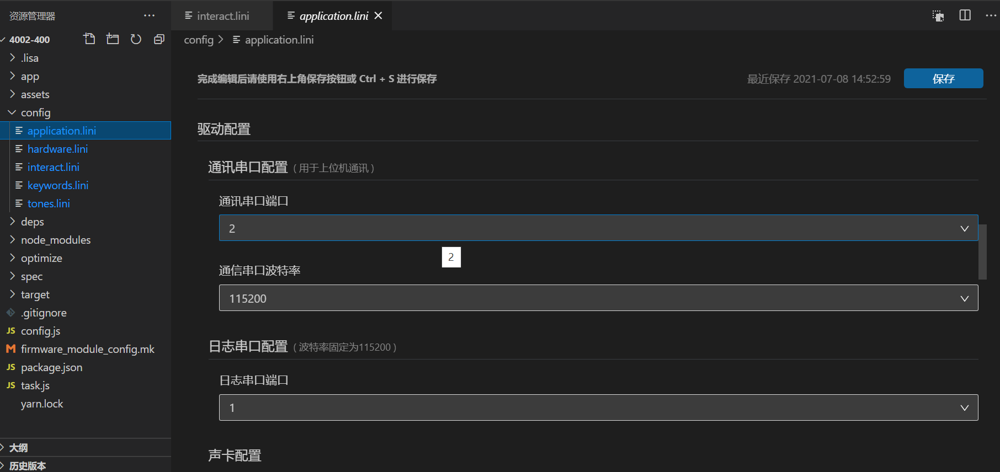
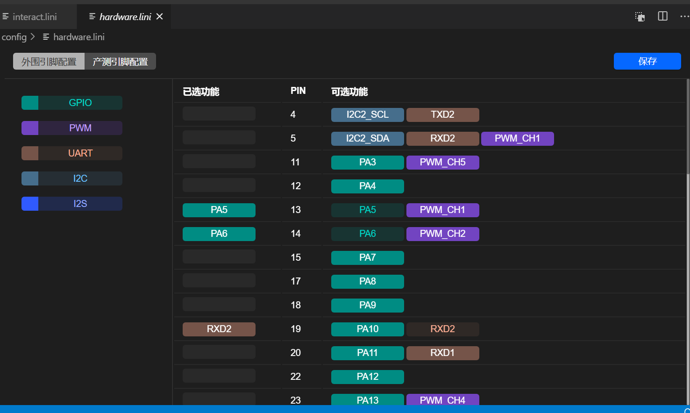

# 常见问题

## 基础功能开发

### Lisa项目master源码在哪里？
项目根目录\node_modules\@source\csk4002\source

### 修改4002源码编译后如何放到Lisa项目中打包？
1. 需要将4002 source文件拷贝到其他目录下，修改后双击build.bat脚本进行编译，编译生成master.bin，路径：\out\target\master.bin
2. 将编译生成的master.bin替换Lisa项目根目录下的target\building\master.bin文件
3. 在LStudio终端使用Lisa task build:package进行lpk打包
4. 使用Lisa flash 进行烧录

### Lisa flash命令无法烧录，如何解决？
1.首先确认castor的设备是否能够被电脑正常识别


2.若设备驱动正常识别仍无法使用Lisa flash进行烧录，请提取报错信息通过工单系统反馈给聆思。

### IO口需要设置为上拉输入需要怎样设置？
1.IO状态：
```
// GPIO direction
#define NDS_GPIO_DIR_INPUT             0x0
#define NDS_GPIO_DIR_OUTPUT            0x1
```
2.代码中的示例：
```
void
factory_check_enter_init(void)
{
		int pin = 0;
		int mux = 0;

		// factory check enter pin initailize
		pin = factory_config.check_enter.pin;
		factory_set_pin_as_gpio(pin);

		// set direction in
		mux = io_mux_table[pin].mux;
		if (mux &lt; 2) {
			driver_gpio_table[mux]-&gt;SetDir(1 &lt;&lt; io_mux_table[pin].num, NDS_GPIO_DIR_INPUT);
			driver_gpio_table[mux]-&gt;Control(
NDS_GPIO_MODE_PULL_NONE, 1 &lt;&lt; io_mux_table[pin].num);  // pull none
		} else {
			CLOGE("PIN(%d) INIT ERROR", pin);
		}
}
```

## 驱动开发
### 源码中GPIO控制，PWM输出，TIMER控制，IIC通信，IIS通信等使用示例？
详见：硬件抽象层开发指南。
[CSK4002硬件抽象层开发指南 V1.5.pdf](https://open.listenai.com/resource/open/doc_resource%2F%E8%BD%AF%E4%BB%B6%E5%BC%80%E5%8F%91%E6%8C%87%E5%8D%97%2FCSK4002%E7%A1%AC%E4%BB%B6%E6%8A%BD%E8%B1%A1%E5%B1%82%E5%BC%80%E5%8F%91%E6%8C%87%E5%8D%97%20V1.5.pdf)

### 如何对支持以外的ADC进行配置？
**I2S音频输出格式（以4002为例）：**

- csk：master
- 上位机：slave
- mclk：4.096MHz
- bclk：2MHz(2.048MHz)
- lrclk：16KHz
- LRCLK左右声道各2个音频通道，每个通道位深32bit，通道12为mic原始音频，高24位有效，通道34为降噪后音频数据，高16位有效。


### 如何开发红外发送功能？
CSK4002已支持红外码单工发送功能，在LStudio设置对应的工作模式，配置命令词对应的红外码以及PWM频率、占空比即可。
另外暂无现成红外接收开发代码支持。

### 如何在app_main里实现自定义协议的串口交互？

使用lskit 4002串口功能实践，配置通信串口，当说 打开空调发送“AA0000FF”，关闭空调“AA0001FF”，并在接到命令后分别回复“AA0F80FF”，解析后播放“风扇打开串口功能测试”，“AA0F81FF”解析后播放“风扇关闭串口功能测试”。回复命令通过串口工具模拟就可以。

**1.添加输出指令** 


**2.app_main.c逻辑实现**
``` 
static void
uart_task_proc(void *arg)
{
    uint8_t data[MAX_CUSTOM_UART_BUF_CNT];
    uint16_t size = 0;
    uint16_t to_recv = 0;

    while (true) {
        // 从 UART 读取数据
        // size = csk_uart_recv(&amp;data, sizeof(data), portMAX_DELAY);
        // 3 串口通信处理
        bool iscur = custom_uart_recv_proc(&amp;data[0], to_recv);
        if (!iscur) {
            CLOGD("[APP]ESR uart_task_proc recvice fail.");
        }
        // 将数据交给 ScriptEngine 处理
        // csk_script_handle_uart(data, size);
    }

    vTaskDelete(NULL);
}


/** 3
 *  上位机发送AA0F80FF，播放打开空调
 *  上位机发送AA0F81FF，播放关闭空调
 */
static void
custom_handle_cmd(uint8_t *data)
{
    CLOGD("[custom_handle_cmd]");
    uint16_t pid = -1;
    uint8_t ttsplay = data[CUSTOM_CMD_TTS];
    switch (ttsplay) {
        case 0x80:
            pid = 1;
            break;
        case 0x81:
            pid = 2;
            break;
        default:
            break;
    }

    if (pid &gt; 0) {
        csk_player_start(&amp;pid);
    }
}

bool
custom_uart_recv_proc(uint8_t data[], uint16_t to_recv)
{
    int wait_ms = 10;
    CLOGD("[custom_frame_recv_proc] 1.HDR");
    // 1. receive HDR
    to_recv = 1;
    if (to_recv == csk_uart_recv(&amp;data[0], to_recv, portMAX_DELAY)) {
        CLOGD("[custom_frame_recv_proc] 1.HDR:0x%02x", data[0]);
        if (CUSTOM_FRM_HDR_TAG != data[0]) {
            return false;
        }
    } else {
        goto _CUSTOM_END;
    }

    CLOGD("[custom_frame_recv_proc] 1.HDR");

    // 2. receive msgid
    to_recv = 2;
    if (to_recv == csk_uart_recv(&amp;data[1], to_recv, wait_ms)) {
        CLOGD("[custom_frame_recv_proc] 2.MSGID:0x%02x", data[2]);
        msgID = data[2];
    } else
        goto _CUSTOM_END;

    CLOGD("[custom_frame_recv_proc] 2.msgid");

    // 3. receive 1 byte: data
    to_recv = 1;
    if (to_recv == csk_uart_recv(&amp;data[3], to_recv, wait_ms)) {
        CLOGD("[custom_frame_recv_proc] 3.frm_data:0x%02x", data[3]);
        // to-do
        if (CUSTOM_FRM_TAL_TAG == data[3]) {
            return false;
        }
    } else
        goto _CUSTOM_END;

    CLOGD("[custom_frame_recv_proc] 3.data");
    // 4. handler uart command
    custom_handle_cmd(&amp;data[0]);
    return true;

_CUSTOM_END:
    return false;
}

void
app_main(void)
{
    CLOGD("[APP]Hello world");

    // 唤醒和命令词相关回调，解除注释使用
    csk_handler_register(CSK_EVENT_WAKE_UP, cb_wake_up);
    csk_handler_register(CSK_EVENT_ESR_RECOGNITION, cb_esr_recognition);
    csk_handler_register(CSK_EVENT_ESR_TIMEOUT, cb_esr_timeout);

    // 语音播报相关回调，解除注释使用
    // csk_handler_register(CSK_EVENT_PLAYER_START, cb_player_start);
    // csk_handler_register(CSK_EVENT_PLAYER_FINISH, cb_player_finish);

    // 如需要在 custom 模式下使用 UART，解除下面这一行的注释
    csk_uart_init();

    // 如需要在这里接收 UART，解除下面这一行的注释
    uart_reader_init();
}

```

### PA9作为普通IO口无法控制？
1.hardware.lini去掉pin18 IO配置   
2.在#include "pin_mux.c"里增加：    
```C
void
gpio_init_add(void)
{
	int pin = 18;
	IOMuxManager_PinConfigure(io_mux_table[pin].mux, io_mux_table[pin].num, NDS_IOMUX_FUNC_DEFAULT);
	driver_gpio_table[0]-&gt;SetDir(1 &lt;&lt; io_mux_table[pin].num, 1);
	driver_gpio_table[0]-&gt;PinWrite(1 &lt;&lt; io_mux_table[pin].num, 1);
}
```

3.在main.c里调用pin18初始化
```C  
hardware_init{
...
  adc_init();  // ADC initialize
   gpio_init_add();
}
```

4.gpio控制：  
pin_mux.c    

```C
void sys_PA9_ctrl(bool high_low)
{
	bool ret;
	CLOGI("gpio_ctrl PA9 %d", high_low);
	driver_gpio_table[0]-&gt;PinWrite(1 &lt;&lt; io_mux_table[18].num, high_low);
}
```

```C
	if (key_value == 1) {
		key_value = 0;
		sys_PA9_ctrl(true);
	} else {
		key_value = 1;
		sys_PA9_ctrl(false);
	}

```

### 产测触发引脚是否可以设置为其他引脚？
产测触发引脚可以配置为其他引脚，具体配置方法详见：
[文档中心产测开发](https://docs.listenai.com/AIsolution/ESR/softwaredevelopment/Advanced_development/factory_config)

## 软件和工具

### LStudio的项目如何导入客户定制的提示音频
1.导入音频
点击interact.lini将音频导入：将音频导入Lisa项目根目录/deps/tones_include目录下。


2.在提示音列表中选择对应的音频。

### LStudio的项目如何切换通信串口
1.application.lini里实现通信串口和日志串口的设置


2.如果涉及UART口的修改，需要再hardware.lini里将通信串口或日志串口配置到对应引脚上。


### 使用Lisa Flash指令下载不了固件，如图所示

                  1、确认PB16正常拉低，且先拉低后上电； 

2、检查烧录驱动正常安装，可以短接PB16的时候看设备管理是否有caster_libusb0的设备; 

3、确认使用的usb线是数据线，不是充电线，因有些usb线只有充电功能，没有传输数据的功能，且线与烧录点接触正常

### 如何查看CSK4002固件中使用的封装库版本号，前端版本号，后端版本号等信息

可以通过输出的初始化日志，查看算法库版本信息，如下图日志打印标记，从日志可获知版本信息如下：

封装库版本：4002.aiwrap.v1000.2.0.3 beta (May 22 2021 14:37:57)

前端CAE库版本：4002.B1009.v1.beta5

后端ESR库版本：4002.miniesr.v1266.1.0.2 beta (May 11 2021 16:55:15)


## 调试

### CSK平台目前提供哪一些调试的手段？
CSK4002支持串口shell交互式调试，请向FAE获取使用文档。

JLINK相关开发工具暂时未对外开放。


