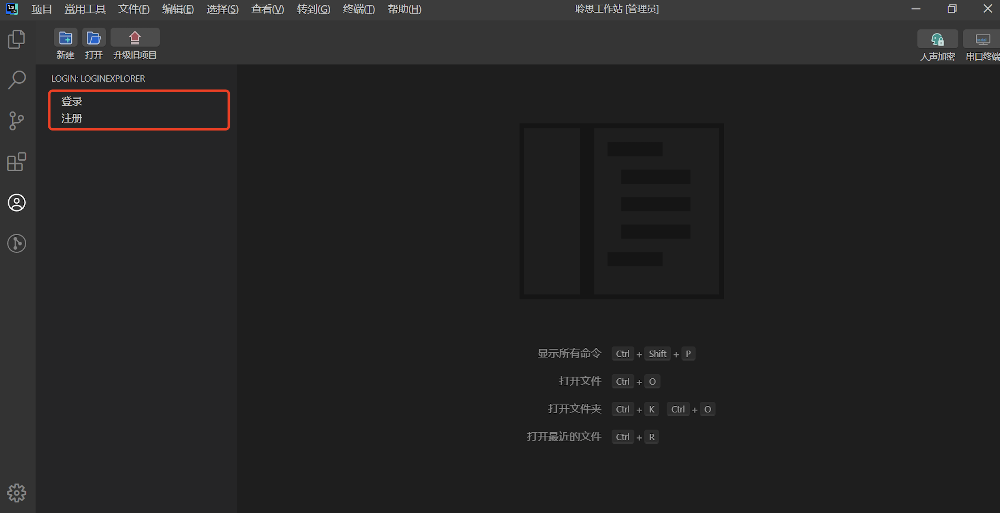
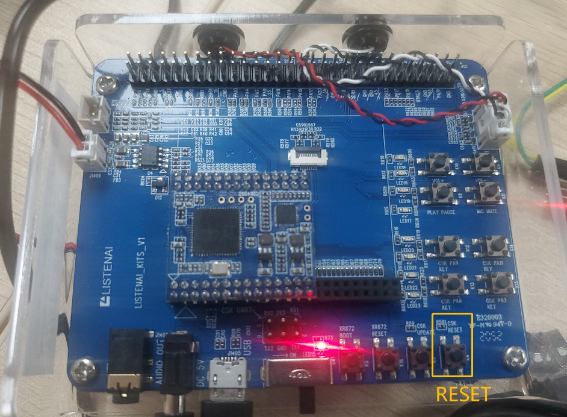
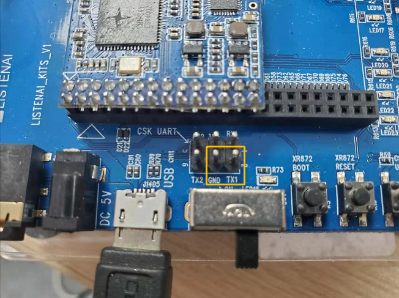

# 快速开始 

> 通过本篇文章你将了解到：
- 基于LStudio完成项目配置、打包烧录
- 获得第一个语音交互demo

## 1. 做好准备

### 1.1 下载安装 LStudio

点击[此处](https://castor.iflyos.cn/castor/v3/lstudio/download)下载 LStudio 安装包，依次点击 “下一步” 直至安装完成。

### 1.2 登录

注册聆思账号并登录。


### 1.3 安装驱动

点击左上方常用工具，安装烧录驱动。


### 1.4 准备 LSKits 开发板

你需要拿到一个聆思官方的开发板，请关注聆思科技公众号（LISTENAI），联系聆思商务团队获取。

> 其他：[聆思开发板 LSKits 组装说明](https://www.bilibili.com/video/BV1po4y1d7fB)

## 2. 快速搭建一个离线语音固件demo

请按照文档说明逐步操作。

### 2.1 创建项目

#### 打开命令行终端

接下来一些列的操作需要用到命令行进行操作。你可以在 LStudio 界面右上角点击「终端」按钮唤起系统终端。也可以使用 `Ctrl + ~` 打开 LStudio 内置的终端。


#### 检查 LISA 环境

CSK项目的创建依赖 LISA 环境。

:::tip 什么是LISA
LISA（Listenai Independent Software Architecture）是聆思智能提供的软件框架，支持客户通过命令行工具使用并管理聆思提供的软件包。 
:::

在终端输入命令行 `lisa -v`，看到 LISA 版本号，代表 LISA 准备就绪

```shell
> lisa --version
@listenai/lisa/1.3.8 win32-x64 node-v14.15.4
```

#### 选择创建项目的路径 

项目创建需要指定的路径创建项目。请使用 `cd` 命令指定路径，如：

```shell
> cd C:\Users\oralzl\项目文件夹
```

#### 输入创建命令

请使用这个命令创建项目 `lisa create newProject -t @generator/csk`，输入创建命令之后，创建模板会提供架手架配置项目所需其他软件包。

> 
- `lisa create` 是 `lisa` 用于创建项目的命令
- `newProject` 代表项目文件夹名称，可自定义。仅支持英文数字、下划线、`-`
- `-t` 代表使用模板（template）创建项目
- `@generator/csk` 是CSK语音交互项目的标准模板

请依次选择 `@source/csk4002`、`4.2.0`（可选最新版本）、`@board/lskits-csk4002`、`通用`、`@algo/general`

```shell
> lisa create newProject -t @generator/csk
✔ 启动创建...
……
? 选择芯片方案 @source/csk4002
? 选择基础固件版本 4.2.0
✔ 创建csk开发项目目录/文件
✔ 安装源码
? 选择板型模版 @board/lskits-csk4002
? 选择项目语言 中文
? 选择项目品类 通用
? 选择算法模型 @algo/general
✔ 安装必要依赖
✔ 源码初始化
✔ lskit配置准备
```

完成项目创建之后，LStudio 会自动打开新项目。


### 2.3 资源配置

为了实现语音交互，你需要添加自定义唤醒词和命令词。为方便开发者快速实现产品开发，我们提供了近20个常用设备场景模板，品类涵盖冰箱、空调和风扇等（持续丰富中）。请点击「顶部工具栏-交互配置」，选择**小风扇**模板然后点击「保存」。如下图所示：


### 2.4 固件打包

接下来需要对固件进行打包。

在当前项目中，打开命令行终端，输入 `lisa build` ，触发固件构建流程。

```shell
> lisa build
  √ 固件编译
  √ 编译respak.bin
  √ 打包lpk包
```

:::tip 什么是LPK
LPK 文件是最终构建产物，可用于 LISA 烧录
:::

### 2.5 固件烧录

最后，你需要将打包好的固件烧录进 LSKits：[聆思开发板LSKits固件烧录说明](https://www.bilibili.com/video/BV18T4y1P7Pm)。


1. **请准备 micro-usb 数据线**（请注意不是圆口电源线，某些 USB 线无法进行数据传输，需要确认排查），使用 USB 数据线连接 LSKits 与电脑，关闭 LSKits 开关（左拨）；

2. **按住** LSKits 上的 **update** 键，再打开开关（右拨），**先不要松开 update 键**；

3. 在当前项目中，打开命令行终端，输入 `lisa flash` ，触发固件烧录流程。

```shell
> lisa flash
  √ 解压LPK文件
  √ 解析配置文件
bin list > flashboot(0),master(0x10000),script(0xf0000),respak(0x100000)
[-]设备请进入烧录模式...
烧录分区 1｜ ████████████████████████████████████████ | 17.85 KB/17.85 KB | flashboot(0)
烧录分区 2｜ ████████████████████████████████████████ | 475.84 KB/475.84 KB | master(0x10000)
烧录分区 3｜ ████████████████████████████████████████ | 3.91 KB/3.91 KB | script(0xf0000)
烧录分区 4｜ ████████████████████████████████████████ | 4370.25 KB/4370.25 KB | respak(0x100000)
烧录完成
```


4. 烧录完成后，按击 LSKits 的 **reset** 键，新烧录的固件即可生效。




:::tip 若烧录失败，请检查：
1. 是否已准确执行上方烧录流程；
2. 是否已安装烧录驱动；
3. 请确保 LSKits 上的芯片型号是4002；
4. 烧录或者重启的时候，需要把串口拔掉。硬件上串口电源会倒灌，可能引起无法重启或者烧录；
5. 若连续烧录失败，请联系FAE/提交工单寻求帮助。
:::

### 2.6 “你好哈利！”

恭喜你得到了第一个固件。现在你可以使用唤醒词**你好哈利**和**交互配置中的命令词**与 LSKits 进行交互了。

你也在 LStudio 集成的串口工具中查看语音交互过程中的日志。你需要先自备串口连接电脑与 LSKits。

如下图，**串口 RXD** 接 **LSKits TX1**，**串口 GND** 接 **LSKits GND**。





在串口完成对接后，打开 LStudio 串口工具，打开检测到的串口，即可看到交互过程中的日志：


