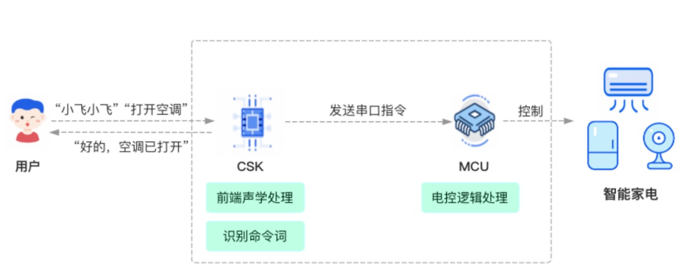
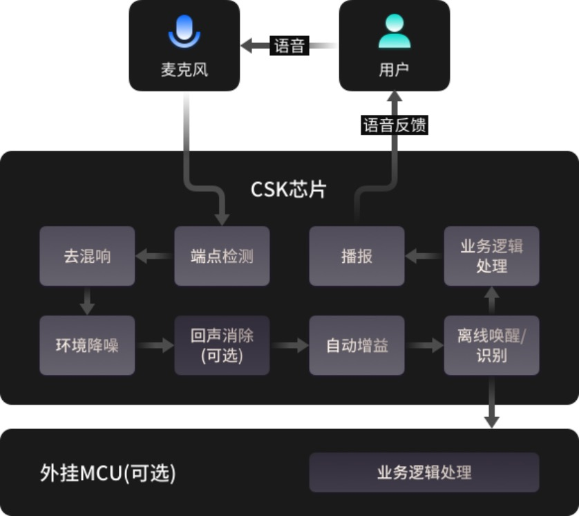
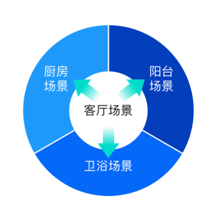
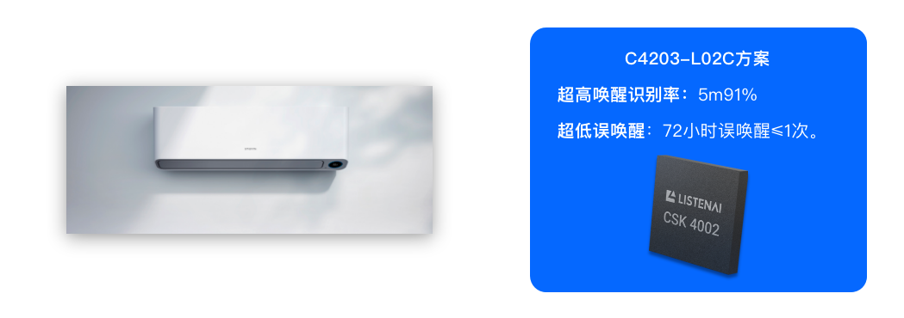
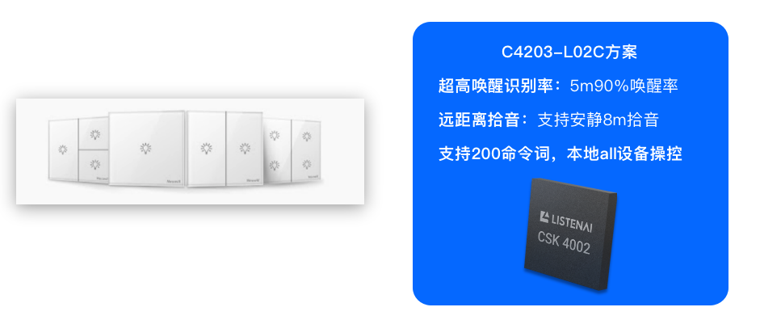
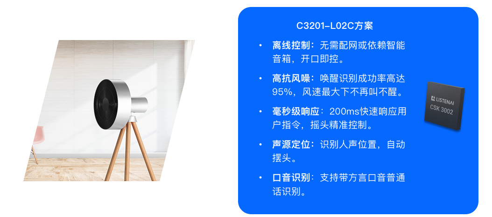
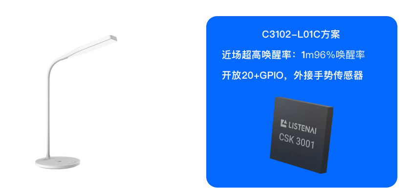

# 方案介绍

> 通过本篇文章你将了解到：
- 离线语音交互方案的原理、使用场景
- 聆思离线语音交互方案说明和方案优势
- 使用聆思离线语音交互方案的落地案例

> 观看视频课程：[离线语音交互方案介绍](https://www.bilibili.com/video/BV1JV411H763)

## 离线语音交互控制优势

传统家电控制方式有以下缺点：
- 按键控制：需要走近产品，按键复杂，不方便老人和小孩使用；
- 遥控控制：找不到遥控器，并且容易丢失和损坏；
- APP控制：需要给设备配网，每次控制都需要打开APP；
- 智能音箱控制：需要给设备配网，依赖智能音箱，响应慢，不保护隐私。

:::info
使用离线语音交互方案，综合用户体验最佳，是极具性价比的智能解决方案。
:::

## 离线语音交互场景

通常语音模组（CSK）承担前端声学处理、唤醒词/命令词识别等工作，并将识别结果通过串口指令发送到产品原MCU上，随后由原MCU实现产品控制。

## 离线语音交互处理逻辑

## 聆思离线语音交互方案效果

满足多种环境降噪需求，强大的语音交互效果。
:::info
- 唤醒率 ≥ 95% 
- 识别率 ≥ 93% 
- 误唤醒 ≤ 1次/72小时
- 支持200条命令词
:::

### 核心优势一：业界首发全栈神经网络的声学算法

- 支持由客卧场景扩展到家庭全场景语音交互
- 支持波束形成、声源定位、去混响、回声消除、语音分离 

:::info 风扇降噪音频示例
降噪前：
<audio id="audio" controls preload>
      <source id="mp3" src="/audio/audio1.mp3"/>
</audio>

降噪后：
<audio id="audio" controls preload>
      <source id="mp3" src="/audio/audio2.mp3"/>
</audio>
:::

:::info 厨房降噪音频示例
降噪前：
<audio id="audio" controls preload>
      <source id="mp3" src="/audio/audio3.mp3"/>
</audio>

降噪后：
<audio id="audio" controls preload>
      <source id="mp3" src="/audio/audio4.mp3"/>
</audio>
:::

### 核心优势二：全新离线语音唤醒识别架构

机器自动搜索和设计最优网络和参数，效果优于人工设计网络；
:::info 
- 全场景唤醒率>95%；语音识别率>93%;
- 误唤醒率：连续电视冲击<1次/72H；
- 睡眠场景，0次/7*24H
:::

## 聆思单双麦方案对比

| 方案名称 | C3101-L01C  |  C3102-L01C   | C3201-L02C   | **C4203-L02C** |
|----|-----|--------|------------------------|------------------------|
| 芯片         | 3001        | 3001        | 3002        | 4002                               |
| 麦克风阵列   | 1 mic       | 1 mic       | 2mic        | 2mic                               |
| 命令词数量   | 最多50条    | 最多50条    | 最多50条    | 最多200条                          |
| 功耗         | 60mA@5V     | 60mA@5V     | 60mA@5V     | 130mA@5V                           |
| 适用环境     | 常见客卧    | 常见客卧    | 嘈杂客卧    | 客卧、卫浴、厨房、阳台、会议、卖场 |
| 综合唤醒率   | 90%         | 92%         | 94%         | 95%                                |
| 综合识别率   | 88%         | 90%         | 92%         | 93%                                |
| 误唤醒       | ≤1次/24小时 | ≤1次/24小时 | ≤1次/48小时 | ≤1次/72小时                        |
| 全双工交互   | 支持        | /           | /           | 支持                               |
| 外语交互     | 英语、日语  | 英语、日语  | 英语、日语  | 英语、日语                         |
| 在线语音交互 | /           | /           | /           | 支持                               |

## 落地案例

### 智能空调（C4203-L02C）
背景：
- 空调行业知名品牌HR、YM，一直有智能空调规划战略，在当前竞争激烈的市场中通过创新方案进一步提高产品竞争力。

主要需求：
- 高标准的唤醒识别率
- 72小时家居场景误唤醒低于3次

推荐方案：

### 智能中控面板（C4203-L02C）
背景：
- 面板行业头部品牌，成立智能中控面板部门，专门对接CSK语音智能面板方案。

主要需求：
- 面板作为本地中控，通过2.4G协议控制其他家电
- 5m嘈杂环境88%唤醒识别率
- 190+命令词

推荐方案：

### 智能语音风扇（C3201-L02C）
背景：
- 某风扇行业头部品牌在自家的高端落地扇上，优先接入CSK3001-L02C离线语音交互方案，为高端机型赋予升级亮点，重新定义风扇智能场景，满足各类风扇使用人群痛点。

主要需求：
- 成本可控
- 响应速度快
- 30+命令词

推荐方案：

### 智能台灯（C3102-L01C）
背景：
- 某台灯板卡厂，年出货2kk，2021年通过直播带货，使智能语音台灯成为潜力爆款，计划总出货量500k。

主要需求：
- 成本低
- 近距离交互效果95%以上
- 外接传感器

推荐方案：

