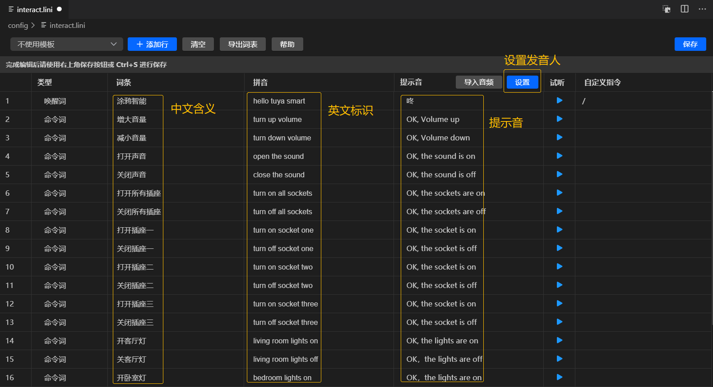

# CSK 外语资源集成说明

## 1 需求确认

请先以下例表格的形式收集客户的唤醒词和命令词的词表资源需求

| id | 类型  | 中文词条   | 外语词条                   | tones                   |
|----|-----|--------|------------------------|-------------------------|
| 0  | 唤醒词 | 你好小美  | hello little beauty       | 咚(特殊音效)                 |
| 1  | 命令词 | 增大音量   | turn up volume         | OK, Volume up           |
| 2  | 命令词 | 减小音量   | turn down volume       | OK, Volume down         |
| 3  | 命令词 | 打开声音   | open the sound         | OK, the sound is on     |
| 4  | 命令词 | 关闭声音   | close the sound        | OK, the sound is off    |
| 5  | 命令词 | 打开所有插座 | turn on all sockets    | OK, the sockets are on  |
| 6  | 命令词 | 关闭所有插座 | turn off all sockets   | OK, the sockets are off |
| 7  | 命令词 | 打开插座一  | turn on socket one     | OK, the socket is on    |
| 8  | 命令词 | 关闭插座一  | turn off socket one    | OK, the socket is off   |
| 9  | 命令词 | 打开插座二  | turn on socket two     | OK, the socket is on    |
| 10 | 命令词 | 关闭插座二  | turn off socket two    | OK, the socket is off   |
| 11 | 命令词 | 打开插座三  | turn on socket three   | OK, the socket is on    |
| 12 | 命令词 | 关闭插座三  | turn off socket three  | OK, the socket is off   |
| 13 | 命令词 | 开客厅灯   | living room lights on  | OK, the lights are on   |
| 14 | 命令词 | 关客厅灯   | living room lights off | OK，the lights are off   |
| 15 | 命令词 | 开卧室灯   | bedroom lights on      | OK，the lights are on    |
| 16 | 命令词 | 关卧室灯   | bedroom lights off     | OK，the lights are off   |
| 17 | 命令词 | 连接网络   | connect to network     | connect to network      |
| 18 | 命令词 | 确认连接网络 | network connected      | network connected       |
| 19 | 命令词 | 早上好    | good morning           | good morning            |
| 20 | 命令词 | 晚上好    | good night             | good night              |

## 2 提交外语资源需求

请确认好以下该信息，通过LSCloud提交外语资源需求工单，等待聆思官方释放外语资源。
1. 支持的语种（当前支持日语、英语的需求）
2. 命令词需符合规范，达到语种资源的命名要求

> 工单地址：[lslcoud](https://cloud.listenai.com/)

## 3 外语资源释放

提交外语资源申请后，根据词表资源的大小以及实际训练情况，大约在10~15个工作日左右就会完成资源的训练。
> 外语资源会通过工单释放。

如下为示例的资源包，结构如下：

```
	1156_涂鸦英语模型资源  
	├── include  
	│   ├── basic_defines.h  
	│   ├── dec  
	│   │   ├── dec_cfg.h  
	│   │   ├── dec_err.h  
	│   │   └── dec_type.h  
	│   ├── errcode_module.h  
	│   ├── fea  
	│   │   ├── fea_cfg.h  
    │   ├── fea_err.h  
	│   │   ├── fea_type.h  
	│   │   └── wfea_api.h  
	│   ├── htk_define.h  
	│   ├── ivw  
	│   │   ├── ivw_cfg.h  
	│   │   ├── ivw_err.h  
	│   │   └── ivw_type.h  
	│   ├── ivw_defines.h  
	│   ├── mlp  
	│   │   ├── mlp_cfg.h  
	│   │   ├── wmlp_api.h  
	│   │   ├── wmlp_err.h  
	│   │   └── wmlp_type.h  
	│   ├── param_module.h  
	│   ├── res_loader  
	│   │   └── res_dec_def.h  
	│   ├── sharemem.h  
	│   ├── type_def.h  
	│   ├── util  
	│   │   └── matrix_util.h  
	│   ├── vad  
	│   │   ├── vad_cfg.h  
	│   │   ├── vad_err.h  
	│   │   ├── vad_type.h  
	│   │   └── wvad_api.h  
	│   ├── w_ivw.h  
	│   └── w_res  
	│       └── res_mgr.h  
	├── lib  
	│   ├── arm_r328  
	│   │   └── libw_ivw.a  
	│   ├── arm_rk3308  
	│   │   └── libw_ivw.a  
	│   ├── CSK  
	│   │   └── libmini_esr.a  
	│   └── Win32  
	│       └── ivw.lib  
	├── res  
	│   ├── arm  
	│   │   ├── filler_keywords_main.bin  
	│   │   ├── filler_keywords_minglingci.bin  
	│   │   ├── keywords_main.txt  
	│   │   ├── keywords_minglingci.txt  
	│   │   └── mlp_res_vs_QN_bias32_automl_english_qianquant_newQ_iter2.prinewadjust.bin  
	│   └── CSK  
	│       ├── filler_keywords_main.bin  
	│       ├── filler_keywords_minglingci.bin  
	│       ├── keywords_main.txt  
	│       ├── keywords_minglingci.txt  
	│       └── mlp_res_mva_QN_bias32_automl_english_qianquant_newQ_iter2.prinewadjust.bin  
	└── 涂鸦英语测试结果.xlsx  
```

tones资源的目录结构如下:

```
	tones  
	├── 10.mp3  
	├── 11.mp3  
	├── 12.mp3  
	├── 13.mp3  
	├── 14.mp3  
	├── 15.mp3  
	├── 1.mp3  
	├── 2.mp3  
	├── 3.mp3  
	├── 4.mp3  
	├── 5.mp3  
	├── 6.mp3  
	├── 7.mp3  
	├── 8.mp3  
	├── 9.mp3  
	└── 咚.mp3  
	音频序号及关系对应列表.xlsx

```

## 4 资源集成实施

### 4.1 使用LStudio创建项目

使用`LISA指令`创建工程

### 4.2 使用LStudio进行资源导入和集成

#### 导入模型资源

1. 请解压释放的资源包，将外语声学模型导入到 LStudio 对应目录。

**资源包中CSK声学模型：**

```
{根目录}/res/csk/mlp_res_mva_QN_bias32_automl_english_qianquant_newQ_iter2.prinewadjust.bin 
```

请将该资源导入到LStudio工程中的该目录下，并更名为 `mlp.bin`

```
{工程根目录}/deps/alias/mlp.bin
```

**资源包中VS声学模型：**

```
{根目录}/res/arm/mlp_res_vs_QN_bias32_automl_english_qianquant_newQ_iter2.prinewadjust.bin
```

请将该资源导入到LStudio工程中的该目录下，并更名为 `mlp_vs.bin`

```
{工程根目录}/deps/alias/mlp_vs.bin
```

2. 请解压释放的资源包，将外语语言模型导入到LStudio对应目录

**资源包中CSK唤醒词语言模型：**

```
{根目录}/res/csk/keywords_main.txt
```

请将该资源导入到LStudio工程中该目录下，并更名为 `main.txt`，并拷贝一份为 `main_finaly.txt`

```
{工程根目录}
 └── deps  
	 └── threshold  
	     ├── main.txt
         └── main_finaly.txt
```

**资源包中CSK命令词语言模型：**

```
{根目录}/res/csk/keywords_minglingci.txt
```

请将该资源导入到LStudio工程中该目录下，并更名为 `cmd.txt`，并拷贝一份为`cmd_finaly.txt`

```
{工程根目录}
 └── deps  
	 └── threshold  
	     ├── cmd.txt
         └── cmd_finaly.txt
```

#### 4.2.2 交互配置

以下配置请在 `interact.lini` 进行操作： 

1. 请先在词条栏导入中文的词条（需求确认环节中中文词表部分）

2. 在拼音处导入该词在英文字母表文件中对应的英文标识

3. 选择对应语种的发音人（英文发音人为Catherine 和Miya , 日语发音人为 千惠 和 中村 ），进行试听并选择

4. 在提示音处导入对应提示音(可复制粘贴)

5. 编辑完请保存资源



### 4.3 生成基础固件

从LSCloud 上拉取CSK的[源码SDK仓库](https://cloud.listenai.com/common)

1. 确认所释放外语资源的版本：释放的资源名字为1156_英语模型资源，即资源版本为1156

2. 确认CSK源码SDK中所使用的识别模型的版本：
- 查看 `library.mk` 中 `LIB_MINI_ESR_VERSION` 的识别模型版本。
- 如在源码下的 `library.mk` 中查看该字段，则SDK使用的版本为 `1156`

```
LIB_MINI_ESR_VERSION := 4002.1156.v1.beta1
```


3. 固件移植和编译：将资源中 `{根目录}/include` 和 `{根目录}/lib/CSK/libmini_esr.a` 等资源替换 CSK SDK 中的对应文件，重新生成CSK基础固件。

4. 基础固件拷贝：将生成后的 `master.bin` 放到 LStudio 工程下 `{根目录}/deps/alias`


### 4.4 打包烧录

使用如下命令重新打包生成固件：

```
lisa task build:respak
lisa task build:package
```

使用如下命令烧录固件到对应的硬件设备中：

```
lisa flash
```

### 4.5 测试

按照需求的词表，进行唤醒和识别测试，至此外语资源集成完毕。
