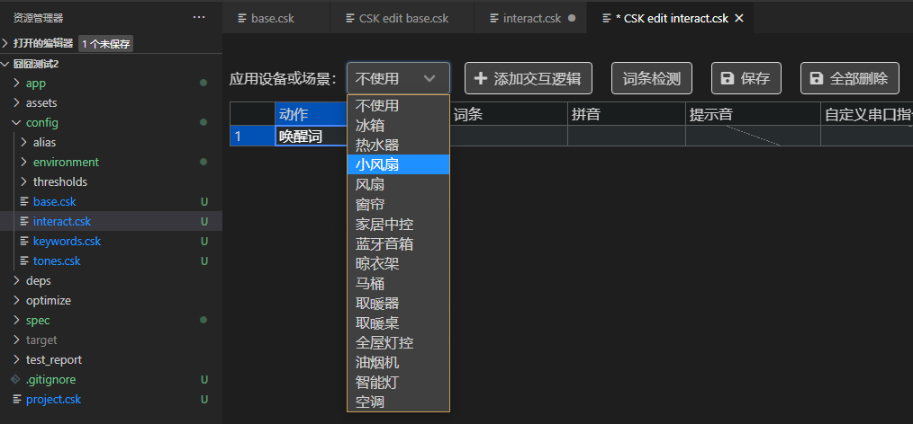
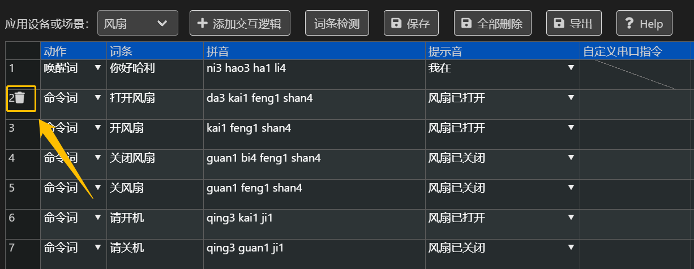

# 配置唤醒词、命令词、提示语

> 通过本篇文章你将了解到：
- 如何通过LStudio快速配置唤醒词、命令词、提示语

## LStudio操作

### 交互模板

聆思基于在语音交互领域的经验，将常用品类的交互模板进行深度定制，并免费开放。

你可以直接选择模板进行使用，也可以在模板的基础上，进行自定义操作。

具体操作如下图

:::info 说明
交互模板的效果会持续升级，模板覆盖品类也会持续增加。
:::

### 自定义词条

- 新增词条时，你可以在【词条】列中 输入、粘贴词条；
- 工具可自动识别拼音；若拼音有误，可自行修改（模型训练时，以拼音为准）；
- 拼音格式：`da3 kai1 kong1 tiao2`，其中字母为拼音，数字为音调（5代表轻声）；

- 如果你不需要部分词条，可以点击列表右侧的删除按钮；

:::tip 通过Excel快速添加
- 可以在本地维护一个excel表，分为【动作】【词条】【拼音】【提示音】【自定义串口指令】5列。其中【拼音】列可以留空。填写完成后，全选复制，并在`interact.lini`中选中第一行第一列的单元格，`Ctrl+V`，即可完成词条和提示音的填写。
:::

:::caution 注意1
- 我们建议尽量从聆思提供的深定制模板中选择词条，可以最高程度保证语音效果。
:::

:::caution 注意2
- 在词条检测后，我们将会自动为你生成拼音，请特别关注多音字提示中的拼音分解是否有误，若有误，请自行手动更改。
:::

### 词条检测

点击【词条检测】可对填写好的命令词进行检测，以下是不同的检测结果说明：

**error（不能使用）**

| 检测结果 | 修改建议 |
| -- | -- |
| 仅支持3-5个中文字 | 唤醒词不得过长或过短。|
| 唤醒词拼音长度不得超过33字节 | 请缩短词条字数。|
| 评分较低不适合当唤醒词 | 请更换唤醒词。|
| 只支持中文 | 若词条中有数字，请转为中文说法；若词条中有字母或英文，请转为相近读音的中文。|
| 不能超过8个字 | 命令词词条字数不能超过8个字。|
| 拼音+音调+空格的长度不能超过33个字节 | 请缩短词条字数。|

**warning（不建议使用）**

| 检测结果 | 修改建议 |
| -- | -- |
| 避免首字是数字 | 容易产生串扰，请尽量在数字前增加其他说法。|
| 避免出现子串 | 容易产生串扰，请尽量在子串前后增加其他说法。|
|  存在多音字 | 请再次检查拼音是否有误。|

### 自定义回复语

#### 语音合成TTS回复语

1. 支持发音人、音量、语速的配置；
2. 点击提示音文本后的【播放按钮】，可进行试听;
3. 合成文本支持中英文、数字、标点符号；
4. 若合成读法有误，可使用`合成标记`对合成音频进行干预；

:::tip 快捷操作
提示音中支持“{词条}”的用户，你可以在下拉列表中选择`将为您{词条}`，或输入`xxxx{词条}xxx`，此时系统会自动为您合成包含词条的提示音。
如：“现在为您{词条}”：
- 当词条是“开灯”时，TTS为“现在为您开灯”
- 当词条是“打开风扇”时，TTS为“现在为您打开风扇”

:::

:::info 常用合成标记
- [h*]：指定单词发音方式。
	- [h1]happy —— 指定为字母发音
	- [h2]happy —— 指定为单词发音
- [n*]：指定数字发音方式。
	- [n1]1200 —— 指定为号码发音：一二零零
	- [n2]1200 —— 指定为数值发音：一千二百
- [=*]：为标记前的一个汉字指定拼音。数字代表音调，支持1~5，其中5为轻声
	- 调[=tiao2] —— 发音为“调整”的“调”
	- 调[=diao4] —— 发音为“音调”的“调”
:::

#### 音效提示音

点击【deps\tones_include】，将本地音频文件拖入该条目下，即完成导入。成功导入后，该文件会出现在`interact.lini`提示音选项中，也会出现在`tones.csk`的代码模式中。

:::caution 提示音格式限制
仅支持16k，mp3格式的音频
:::