# 自定义技能实现


> 本文详细描述了 iFLYOS 自定义技能开发步骤，为开发者提供完整的自定义技能开发指引。阅读本文后，你将了解到
>
> 1.iFLYOS 编写语料，实现技能后处理。
>
> 2.了解如何在设备端实现自定义技能的解析与处理。


## **1.什么是自定义技能** ##

语音技能（Skill）是指智能硬件可以使用自然的语言交流提供服务的能力，类似于手机 APP 的概念，一个语音技能用于解决一类用户需求，不同于手机 App 的地方在于，语音技能使用语音作为交互的入口。

举例：

用户：“今天合肥天气怎么样？”

系统 : ”今天合肥多云，16摄氏度。“

用户：”明天需要带伞吗？“

讯飞 ：”明天多云，不需要带伞。“

iFLYOS 为用户提供了大量的常用语音技能，如音乐播放、天气查询、股票查询等。但如果开发者不想使用其中的某些技能或常用技能无法处理某些用户请求时，希望对用户的语料进行特殊处理，那么需要通过自定义技能实现，自定义技能主要分 iFLYOS 云端与设备端两部分实现，如图下图所示。

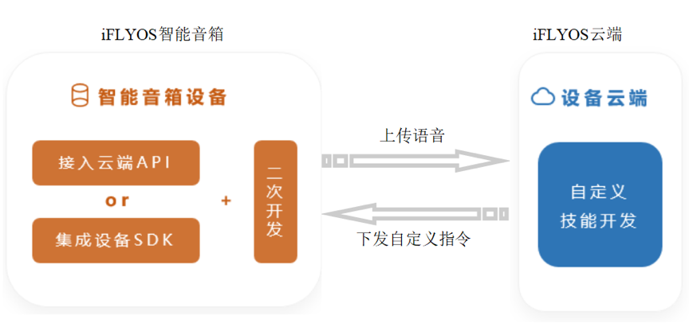

以语音网购水果为例，iFLYOS 官方技能中未实现此技能，开发者需要通过自定义技能来实现：

1. 在 iFLYOS 技能工作室中编写自定义技能，通过前端拦截器拦截“我要买苹果”、“我要买鸭梨”等语料，通过技能后处理向设备端发送自定义指令。
2. 设备端解析 iFLYOS 云端自定义技能下发的自定义指令，并执行相应的操作。


## 2. 讯飞技能工作室

[技能工作室](https://studio.iflyos.cn/index-studio)（Skill Studio） 是一套可视化的人机对话开发平台，是所有搭载了 iFLYOS 或 AIUI 的设备的大脑。讯飞技能工作室为开发者提供了技能设计、开发、测试、发布、优化的工具，开发者可以通过可视化的界面，快速高效地将自己的创意、产品或服务，通过语音技能传达给智能硬件的用户。

按照粒度从大到小划分：设备/应用>技能>意图>语料。

| **粒度**  | **例子**                           |
| --------- | ---------------------------------- |
| 设备/应用 | 小飞音箱，小飞机顶盒，手机APP      |
| 技能      | 线上购物                           |
| 意图      | 购买水果、购买日用品               |
| 语料      | 我要买苹果、我要买鸭梨、我要买榴莲 |


## 3. 技能后处理

为了扩展自定义技能的能力，技能工作室提供了[技能后处理](https://doc.iflyos.cn/studio/post_process/)帮助开发者实现丰富的自定义功能，【技能后处理】位于【语义理解引擎】之后，可以直接与万维网通信。技能后处理逻辑如下图所示：

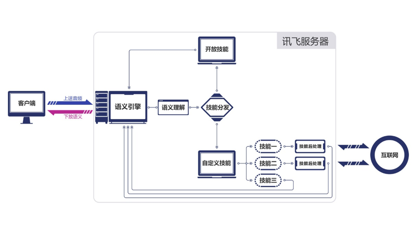


## **4.iFLYOS 技能工作室技能开发步骤** ##

### **4.1 创建自定义技能** ###

首先进入[技能控制台](https://studio.iflyos.cn/skills)，依次选择：【我的技能】—【创建技能】，选择【私有技能】—【iFLYOS】，并填写技能名称，如下图：


### 4.2 创建意图&编写语料

创建【购买水果】的意图，意图名称与英文标识可自定义；

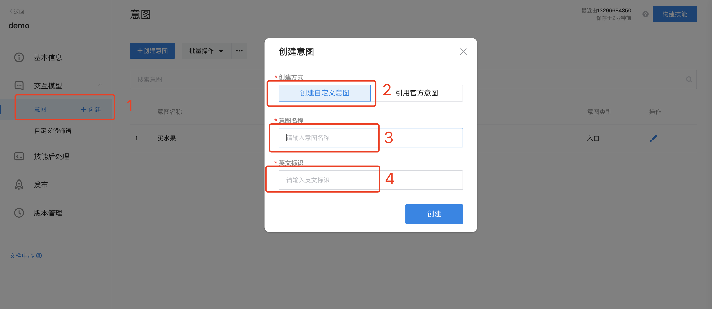

创建后，在意图编辑页填入所需语料（期望用户说什么能触发到这个技能），初期建议开发者取消“智能贴弧”选项（智能贴弧能够根据语料自动匹配槽位及对应实体，该功能尚处测试阶段，不建议开启），如下图：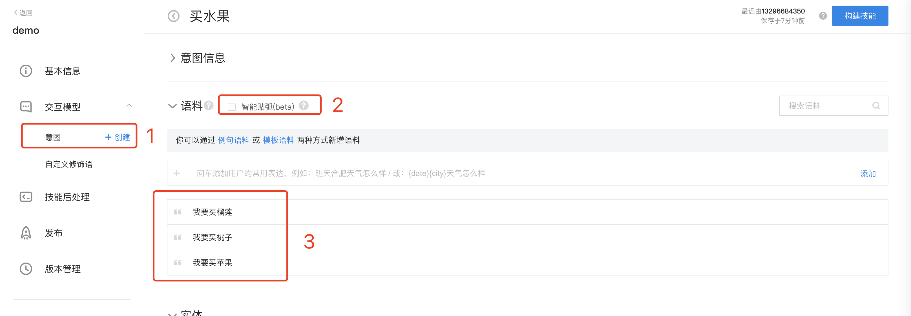

水果的种类繁多，如果一个个写太浪费时间，我们可以对语料中的【水果名称】进行抽象，iFLYOS将之定义为“槽”；格式以大括号括起即可，可任意命名，括号内表示槽名，每个槽需要有对应的实体表示，实体即抽象的对象合集，一个槽位内放置一个实体，如下图：

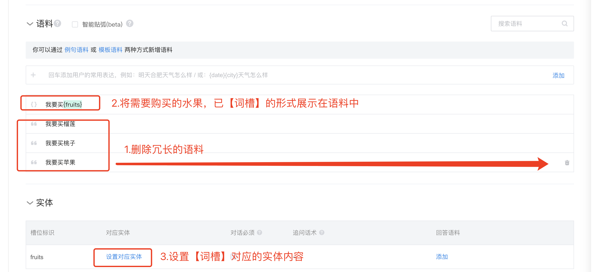

为了方便开发者编写技能，iFLYOS 定义了几十种官方实体。由于官方暂无水果名称相关的实体，所以需要开发者自行在平台创建。

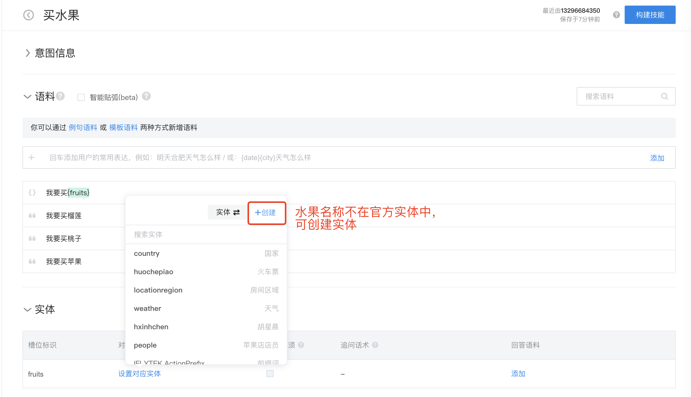


### 4.3 创建实体

在意图编辑页可通过【设置对应实体】-【创建】的方式创建新实体；或在技能控制台【我的实体】tab 栏创建，创建时首先输入实体的名称与英文标识，如下图：

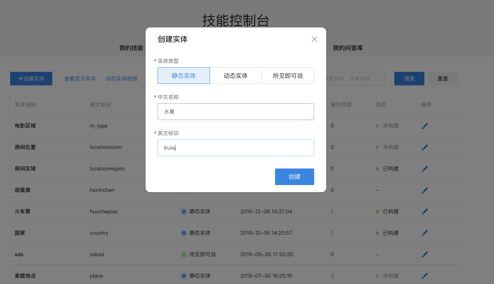

创建实体的词条时，若该词条有多钟叫法，如”梨“也可称之为”鸭梨“，可通过添加词条别名的方式实现；词条编辑完后，点击页面右上角的【构建实体】，成功构建后，实体将正式生效，为技能所用；

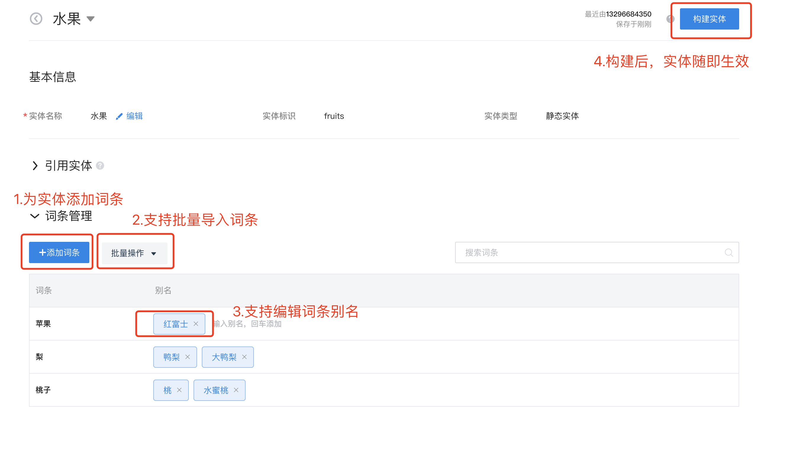

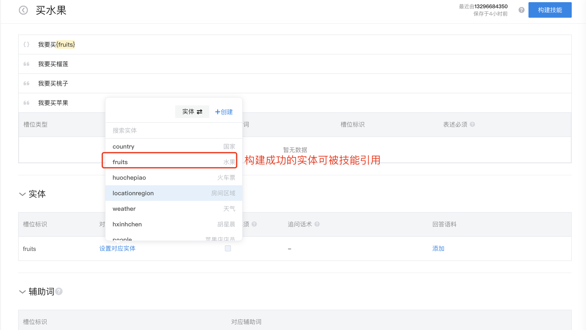


### 4.4 自定义技能后处理

打开技能后处理界面后，可看到该界面主要分为三大区域：代码编写区域、日志打印区域、测试区域，如下图所示；

其中代码接口见：[云函数接口文档](https://doc.iflyos.cn/studio/post_process/api_2.1.html)

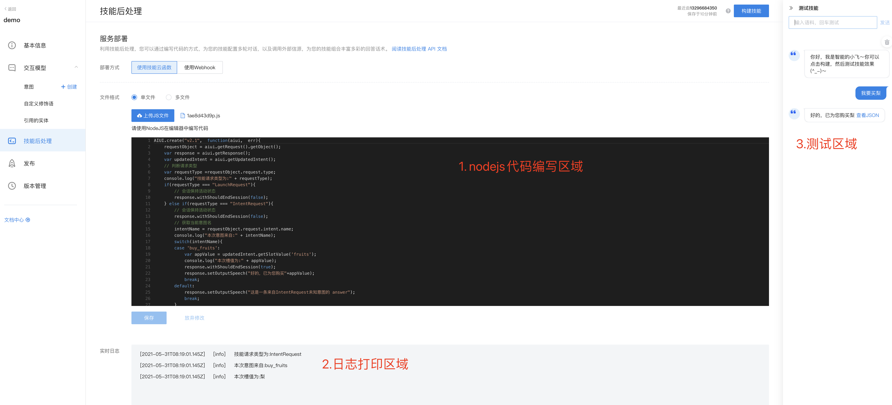


通过后处理代码获取到识别命中的意图或实体，并根据个性化需求将所需字段下发，示例：

```
AIUI.create("v2.1",  function(aiui,  err){
	requestObject = aiui.getRequest().getObject();
	var response = aiui.getResponse();
	var updatedIntent = aiui.getUpdatedIntent();
	// 判断请求类型
	var requestType =requestObject.request.type;
	console.log("技能请求类型为:" + requestType);
	if(requestType === "LaunchRequest"){
		// 会话保持活动状态
		response.withShouldEndSession(false);
	} else if(requestType === "IntentRequest"){
		// 会话保持活动状态
		response.withShouldEndSession(false);
		// 获取当前意图名
		intentName = requestObject.request.intent.name;
		console.log("本次意图来自:" + intentName);
		switch(intentName){
		case 'buy_fruits':
            var appValue = updatedIntent.getSlotValue('fruits');
        	console.log("本次槽值为:" + appValue);
			response.withShouldEndSession(true);
			response.setOutputSpeech("好的，已为您购买"+appValue);
            break;
		default:
			response.setOutputSpeech("这是一条来自IntentRequest未知意图的 answer");
			break;
		}
	} else if(requestType === "SessionEndedRequest"){
		response.withShouldEndSession(true);
	}
	var directives = [{
 		"type" : "Custom",//设备端处理的话type必须是Custom
		 "payload":{
			 //需要自定义携带的字段写在payload里面
			"aaaa":"AAAAA",
			"bbbb":"BBBBB"
		 },
		 //不能写在payload外面
		 //"xxxxxx":"yyyyy"
 	}];
	response.setDirectives(directives);
	aiui.commit();
})
```


### 4.5 测试技能

完成后处理代码编写后，可在测试区域输入技能语料，查看回复语料的JSON文件与日志打印区中的日志是否符合预期。

```
//Request结果：
{
    "version": "2.1",
    "context": {
        "AudioPlayer": "",
        "System": {
            "user": {
                "userId": "1615550221673pkjitl"
            }
        }
    },
    "session": {
        "new": true,
        "sessionId": "8dce6882-817b-40f7-989b-c97ac1b01150"
    },
    "request": {
        "type": "IntentRequest",
        "requestId": "web7152f599@dxbadd13a6a4ca3eef00",
        "timestamp": "2021-05-31 08:00:27.173",
        "dialogState": "STARTED",
        "query": {
            "type": "TEXT",
            "original": "我要买苹果"
        },
        "intent": {
            "name": "buy_fruits",
            "score": 1,
            "confirmationStatus": "NONE",
            "slots": {
                "app": {
                    "confirmationStatus": "NONE",
                    "moreValue": null,
                    "name": "fruits",
                    "normValue": "苹果",
                    "value": "苹果"
                }
            }
        }
    }
}
```

```
//Response结果：
{
    "rc": 0,
    "response": {
        "directives": [
            {
                "payload": {
                    "aaaa": "AAAAA",
                    "bbbb": "BBBBB"
                },
                "type": "Custom"
            }
        ],
        "expectSpeech": false,
        "outputSpeech": {
            "text": "好的，已为您购买苹果",
            "type": "PlainText"
        },
        "shouldEndSession": true
    },
    "sessionId": "8dce6882-817b-40f7-989b-c97ac1b01150",
    "skill": {
        "reqsrc": "OS",
        "skillAction": "node",
        "skillId": "LYHU7.f15981578d",
        "skillType": "nlis",
        "skillUrl": "athena.iflyos.cn/node",
        "skillVersion": "1.0"
    },
    "version": "2.1"
}
```

从以上结果看出，无论是语料命中的意图还是实体，亦或是我们期望携带的自定义参数，都成功下发出来了。


### 4.7 构建并发布技能

通过测试后，需要正式发布技能，才能被设备引用，操作步骤如下：

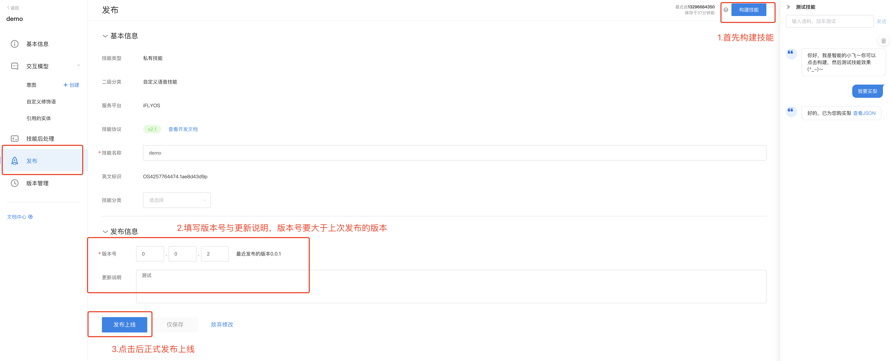


### 4.8 引用自定义技能

自定义技能发布后，需要为你的设备在[拦截器](https://doc.iflyos.cn/device/upgrades/interceptor.html)上配置技能，进入设备控制台，在【语义理解】-【前置拦截器】中选择【内部语义理解服务】，添加刚刚发布的自定义技能，并点击右上角的【保存】按钮即可。


引用技能后，可在设备控制台的【模拟测试】页面，验证自定义技能是否生效，如下图，可在对话框中输入该技能的语料，查看设备回复 tts 与技能下发的自定义字段是否符合预期。
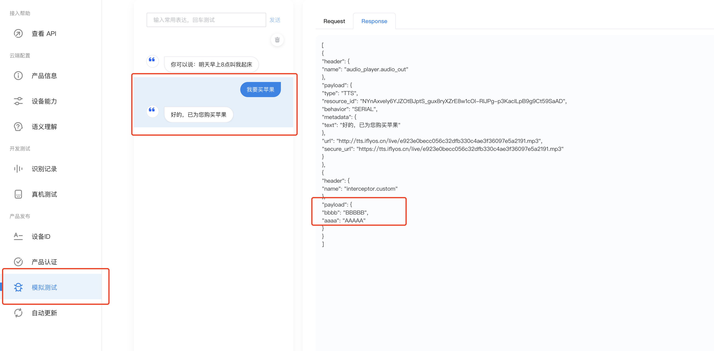

至此，我们已经完成了一个简单自定义技能云端侧的开发。


## **5. 自定义技能设备端实现** ##

关于自定义技能在 Android、Linux 设备端的参考实现，可[点击此处](https://doc.iflyos.cn/device/evs/skills.html#%E8%AE%BE%E5%A4%87%E7%AB%AF%E8%87%AA%E5%AE%9A%E4%B9%89%E6%8A%80%E8%83%BD%E5%AE%9E%E7%8E%B0%E9%80%BB%E8%BE%91)查看；

RTOS设备端（包括 XR872AT、BK7251 等）的参考实现，文档正建设中，敬请期待。

