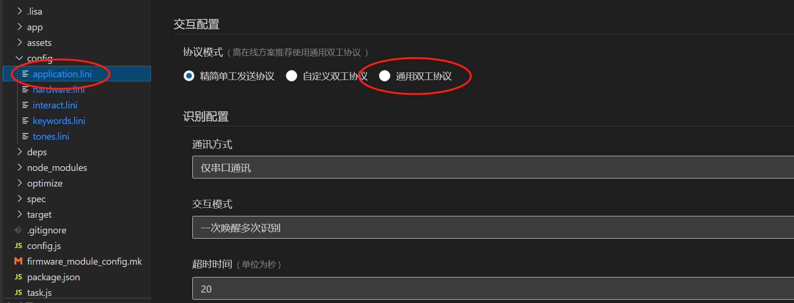

# 制作离在线项目的CSK固件

> 本文主要介绍离在线项目 CSK 固件的制作方法，通过阅读本文，你将了解到：
>
> 如何在 LSTudio 配置、打包、并烧录 LSKIts 离在线开发板的 CSK 固件；

### 1.下载 LSTudio

LSTudio 主要用于 CSK 固件配置与烧录，在 CSK 项目开发指南中的[《快速入门CSK项目开发》](https://open.listenai.com/getting_start)已详细说明如何下载安装 LStudio，此处不再做过多描述。

### 2.在 LSTudio 创建项目

安装 LSTudio 后，鼠标悬停至顶部菜单栏的【项目】，选择【新建】，如下图；选择【固件开发项目】；

【芯片型号及方案】选择 **4002**；

【基础固件版本】选择**3.0.2**（直接选线上最新的版本即可）；

【板型模板】选择**聆思开发板V1.0**；

### 3.音频输出配置

项目创建成功后，找到 `application.toml` 配置文件，文件具体路径如下： `./config/environment/application.toml`；

首先，你需要设置固件的协议模式，在文件中找到  `sys_mode` 字段，并将值设置为 `public`  。如下图：

之后，你需要修改 CSK 输出的音频通道，4002 固件默认输出的音频通道分别是 **[1,2,5,6]**   ，在离在线项目中，需要修改为  **[1.2,8,3]** 。CSK 总共可输出 8 路音频，可选择 4 路输出给上位机。8 路音频分别的含义可参考《LISA API》中 `/Modules/CSK/csk_record_set_i2s_ch` 的定义。

### 4.交互配置

进入交互配置，由于目前离在线项目中，尚不支持离线识别，所有交互都为在线交互。且播放器由上位机控制，CSK不直接播放音频，所以此处可不设置离线命令词以及对应回复语。如何在上位机设置自定义回复语，可参考[《上位机固件二次开发文档》](/)。

### 5.固件打包与烧录

一切配置就绪后，可点击 LSTudio 上的【打包】按钮，如下图

点击打包，并等待打包过程完毕。之后将 LSKits 与电脑通过 USB 线连接，同时按住 LSKits 上的【CSK UPDATE】键，最后点击 LSTudio 上的【烧录】键，进入固件烧录模式，等待固件烧录完毕后，重启 LSKits 即可。
