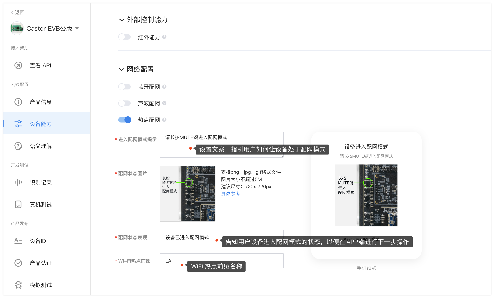
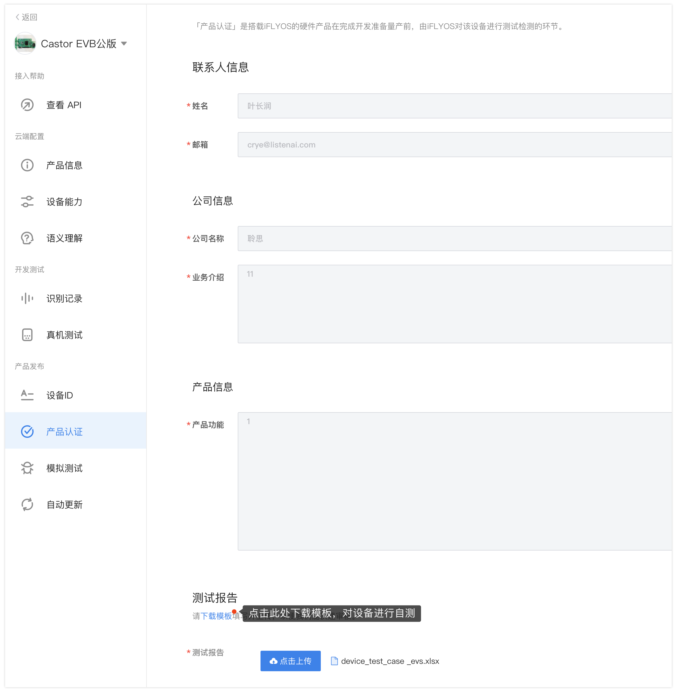

# 上位机固件二次开发


> 本文主要介绍离在线方案运行逻辑，帮助开发者快速理解方案架构。阅读本文后，你将了解到：
>
> 1.了解 XR872AT 的开发环境编译与配置；
>
> 2.了解上位机固件的业务源码结构；
>
> 3.如何自定义 Client_id、OTA_SECRET、AP热点前缀、按键、灯光、本地TTS；
>
> 4.如何在完成二次开发后进行验证；

:::important

需要注意的是，本文档只针对云端接入 iFLYOS 的产品，若开发者对接其他的云端操作系统，该文档并不适用。

:::

## 1.XR872AT 开发环境配置

在进入二次开发之前，可先了解 XR872AT 的固件开发环境与编译方法，方便你在进行二次开发后，编译自己的固件产物。

### 开发环境搭建

- 详细内容见[XRADIO_Quick_Start_Guide-CN.pdf](https://docs.xradiotech.com/zh/latest/download/4.SDK/document/XRADIO_Quick_Start_Guide-CN.pdf) 1.1、1.2、1.3章节

### 编译工具链地址

- Windows版本
  - 链接： https://pan.baidu.com/s/1Ugs8lRApyA3ONs91yXOWbg
  - 提取码：w4gr
- Linux版本
  - 链接： https://pan.baidu.com/s/1BsnmhgXx2zZjIVtJ49ICYQ
  - 提取码：z45o

### 快速编译

#### 编译

- 详细内容见[XRADIO_Quick_Start_Guide-CN.pdf](https://docs.xradiotech.com/zh/latest/download/4.SDK/document/XRADIO_Quick_Start_Guide-CN.pdf) 2章节sdk编译

#### 编译示例

- 对 "listenai_castor_xr872" 工程进行代码编译和镜像创建的常规过程，举例如下：

  ```c
  # 切换到工程编译目录
  $ cd project/listenai_castor_xr872/gcc/
  # 执行 SDK 基础配置， 选择芯片型号为“XR872”， 高频晶振为“40M”
  $ make config
  **
  XRADIO SDK Configuration
  *C
  hip
  1. XR872
  2. XR808
  choice[1-2]: 1
  External high speed crystal oscillator
  1. 24M
  2. 26M
  3. 40M
  choice[1-3]: 3
  # 删除所有 SDK 编译中间文件
  # 该命令为可选命令。 如果没有修改编译选项， 也没有切换工程目录， 可不执行该命令。
  $ make build_clean
  # 编译代码并生成镜像文件
  # 生成的镜像文件为“project/listenai_castor_xr872/image/xr872/xr_system.img”
  $ make build
  ```

#### 编译路径和固件路径

- 编译目录和生成img文件目录如下所示

  ```c
  ├── bin
  ├── chip.mk
  ├── gcc.mk
  ├── include
  ├── lib
  ├── project
  │	├── listenai_castor_xr872
  │  	│	├── gcc						# 编译目录
  │ 	│	├── image
  │  	│	│	├── xr872
  │  	│	│	│	├── xr_system.img	# 编译后生成img文件
  │  	│	│	│	├── ......
  │  	│	│	├── ......
  │  	│   ├── .......
  │   ├── .......
  ├── src
  ├── ......
  ├── tools
    
  ```


## 2.业务源码说明

### evs源码路径

- `/project/listenai_castor_xr872/listenai_sdk/modules/listenai_evs`

### 目录结构

- 代码目录结构及说明

```c
├── listenai_evs
│	├── evs_alertplayer.c		
│	├── evs_alertplayer.h		// 云端闹钟播放管理，解析和播放下发的RING类型的audio_out指令
│	├── evs_aplinker.c
│	├── evs_aplinker.h			// AP配网模块
│	├── evs_audiomgr.c
│	├── evs_audiomgr.h			// 焦点管理模块，负责维护音乐、tts、本地提示音、闹钟、识别焦点
│	├── evs_audioplayer.c
│	├── evs_audioplayer.h		// 音乐播放管理，解析和播放云端下发的PLAYBACK类型audio_out指令
│	├── evs_audiorecorder.c
│	├── evs_audiorecorder.h		// 录音模块以及唤醒结果回调
│	├── evs_auth.c
│	├── evs_auth.h				// evs认证模块
│	├── evs_capaudioplayer.c
│	├── evs_capaudioplayer.h	// 解析分发云端下发的audio_out指令
│	├── evs_client.c
│	├── evs_client.h			// 负责唤醒事件处理，各个模块初始化，websocket链接维护
│	├── evs_event.c				
│	├── evs_event.h				// 消息队列，负责消息分发管理
│	├── evs_flash.c
│	├── evs_flash.h				// 持久化接口
│	├── evs_log.h				// 日志工具
│	├── evs_interceptor.c
│	├── evs_interceptor.h		// 负责处理按键事件，网络连接管理，evs最外层入口
│	├── evs_mediaplayer.c	
│	├── evs_mediaplayer.h		// 负责适配底层播放器，供evs_audioplayer使用
│	├── evs_netmonitor.c
│	├── evs_netmonitor.h		// 网络检测模块
│	├── evs_opts.h				// client_id配置项
│	├── evs_ota.c
│	├── evs_ota.h				// ota模块
│	├── evs_pref.c
│	├── evs_pref.h				// 持久化工具，
│	├── evs_recognizer.c
│	├── evs_recognizer.h		// 识别模块，负责处理语音和文本请求
│	├── evs_response.c			 
│	├── evs_response.h			// 解析云端下发消息
│	├── evs_shortplayer.c		
│	├── evs_shortplayer.h		// 短提示音播放管理，只用来播放唤醒提示音
│	├── evs_soundplayer.c
│	├── evs_soundplayer.h		// 本地提示音播放管理
│	├── evs_speaker.c
│	├── evs_speaker.h			// 音量调节模块，处理本地和云端音量调节
│	├── evs_system.c
│	├── evs_system.h			// 系统相关，负责云端链接心跳维护、状态同步、时间同步
│	├── evs_time.c
│	├── evs_time.h				// 时间同步模块
│	├── evs_timer.c
│	├── evs_timer.h				// 计时器工具
│	├── evs_tone.c
│	├── evs_tone.h				// 获取本地提示音工具
│	├── evs_ttsplayer.c
│	├── evs_ttsplayer.h			// tts播放管理，解析和播放下发的TTS类型的audio_out指令
│	├── evs_utils.c
│	├── evs_utils.h				// 内存池和消息队列工具
│	├── evs_uuid.c
│	├── evs_uuid.h				// UUID生成工具
│	├── evs_websocket.c
│	├── evs_websocket.h			// 云端websocket链接
│	├── evs_wifimgr.c
│	├── evs_wifimgr.h			// wifi管理工具
│	├── ......
```

### evs协议地址

- https://doc.iflyos.cn/device/evs/reference/recognizer.html#context


## 3.更换 Client_id 、OTA_SECRET

当你在 iFLYOS 设备接入平台创建自己的设备后，会获取属于该设备的 `Client_id`。`Client_id` 将会被 iFLYOS 用于判定设备型号，一个型号的设备都会使用相同的 `Client_id`。在二次开发前，你需要替换掉上位机固件中的默认 `Client_id` 。替换后，你在 iFLYOS 平台中的个性化配置将会在固件端生效。修改方式如下：

- 更改 `project/listenai_castor_xr872/listenai_sdk/modules/listenai_evs/evs_opts.h` 中 `Client_id` 宏定义。
- 更换 `Client_id` 后，还需要更换对应的 `OTA_SECRET`，该字段主要用于固件OTA时的校验，可在【设备能力】-【自动更新】-【加密密钥】中获取。与 `Client_id` 在同一文件中，对应宏定义为  `OTA_SECRET`。


## 4.修改热点前缀

在修改热点前缀之前，请先了解[ AP 配网流程](https://doc.iflyos.cn/device/network/ap.html#ap-%E9%85%8D%E7%BD%91)。

若你希望自定义热点前缀名，可按照如下步骤操作：

第一步，在 iFLYOS 平台的【设备能力】-【热点配网】-【 Wi-Fi 】热点前缀处修改，在此处修改并保存后，小飞在线 APP 端将实时生效。配网时，APP 端将根据你在 iFLYOS 平台设置的前缀寻找热点并连接。



第二步，在固件代码中修改前缀 ，位于 `evs_netconfig.c`，如下。修改完成并烧录固件后，设备进入配网模式，广播时的热点前缀将变为自定义前缀。

```c
void
evs_net_config_begin(evs_net_config_t *handle)
{
	handle->m_is_config = true;
	handle->m_wifi_connect = false;
	handle->m_client->m_is_configing = true;
	handle->m_link_ssid[0] = '\0';
	handle->m_link_pwd[0] = '\0';
	handle->m_link_usr_code[0] = '\0';
	handle->m_refresh_token[0] = '\0';
    // 前缀修改
	char ap_name[7] = "LA_";
	char device_id[65];
	strcpy(device_id, evs_client_get_deviceid());
	int pos = strlen(device_id) - 3;
	strncpy(ap_name + 3, device_id + pos, 3);
	ap_name[6] = '\0';
    // 修改前缀示例
    // char ap_name[9] = "LISA_";
	// char device_id[65];
	// strcpy(device_id, evs_client_get_deviceid());
	// int pos = strlen(device_id) - 3;
	// strncpy(ap_name + 5, device_id + pos, 3);
	// ap_name[8] = '\0';
	evs_aplinker_stop_link(handle->m_ap_linker);
	evs_timer_stop(handle->m_accept_timer);
	evs_timer_stop(handle->m_data_timer);
	evs_timer_stop(handle->m_reconnect_timer);
	evs_timer_set_timeout(handle->m_accept_timer, _on_accept_time_out, AP_LINKER_ACCEPT_TIMEOUT);
	evs_soundplayer_play(handle->m_sound_player, get_tone_url(TONE_ID_8));
	evs_client_stop(handle->m_client);
	handle->m_wifi_mgr->wifi_disconnect();
	evs_aplinker_start_link(handle->m_ap_linker, ap_name);
}
```


## 5.自定义按键

CSK 离在线开发套件中已配备四个功能按键和一个硬件控制复位按键，四个功能按键分别是禁麦|开麦、音量+、音量-、播放|暂停。开发者可根据自身产品需求，自定义按键功能。支持单按键与组合键触发，触发方式包括单击与长按。

1、按键事件注册入口 `evs_interceptor.c`

```c
evs_interceptor_t *
evs_interceptor_create()
{
	evs_interceptor_t *handle = (evs_interceptor_t *)evs_calloc(1, sizeof(evs_interceptor_t));
	evs_time_init();
	handle->m_led_mgr =  evs_led_mgr_create();
	handle->m_client = evs_client_create();
	evs_handler_set_handler(_handle_msg);
	evs_set_key_callback(_on_key_down, _on_key_long_press);// 按键事件注册入口
	handle->m_sound_player = evs_client_get_soundplayer(handle->m_client);
	handle->m_speaker = evs_client_get_speaker(handle->m_client);
	handle->m_audio_player = evs_client_get_audioplayer(handle->m_client);
	handle->m_tts_player = evs_client_get_ttsplayer(handle->m_client);
	handle->m_alert_player = evs_client_get_alertplayer(handle->m_client);
	handle->m_recognizer = evs_client_get_recognizer(handle->m_client);
	handle->m_net_config = evs_net_config_create(handle->m_sound_player, handle->m_client);
	s_interceptor = handle;
	return handle;
}
```

2、按键事件定义 `evs_key_event.h`

```c
typedef enum _KEY_EVENT { 
    KEY_VOL_DOWN = 0, //音量减事件
    KEY_VOL_UP, //音量加事件
    KEY_PLAY, //播放按键事件
    KEY_MUTE, //MUTE键事件
    KEY_MUTE_VOL_UP,// 目前定义的组合按键，同时按下MUTE和音量加
    KEY_MUTE_VOL_DOWN // 目前定义的组合按键，同时按下MUTE和音量减
} KEY_EVENT;

// 短按事件回调接口
typedef void (*key_press_callback)(KEY_EVENT event);

// 事件回调接口
typedef void (*key_longpress_callback)(KEY_EVENT event);
```

3、驱动层实现 **evs_key_event.c**

```c
extern void listenai_key_callback(key_press_callback pressCb, key_longpress_callback longPressCb);//驱动层需要实现此函数，通过pressCb回调对应的短按事件，通过longPressCb回调对应的长按事件
```


## 6.自定义灯光

在产品实际使用过程中，上电、配网、语音交互等业务逻辑都会以灯光的形式提示用户，合适的灯光提示对于智能语音设备来说不可或缺。

1、灯光焦点管理模块

固件端根据用户使用产检，设计并维护了一套灯光焦点管理模块，该模块主要负责维护所有灯光的开关，创建、销毁、灯光优先级管理、灯光的打断恢复。

具体代码说明如下：

```c
// 灯光焦点管理模块初始化，如果要屏蔽灯光模块，请在此方法第一行return NULL;
evs_led_mgr_t* 
evs_led_mgr_create()
{
    int ret = disp_i2c_init();//灯光驱动初始化
    if (ret != 0) {
        return NULL;
    }
	led_init();//灯光具体效果初始化
    evs_led_mgr_t* handle = evs_calloc(1, sizeof(evs_led_mgr_t));
	// led_ctrl(LED3_MASK, LED_ON, 0xff0000);
    handle->m_lights[LED_ALARM] = (base_light_t*)alarm_light_create(_on_light_close);
    handle->m_lights[LED_BOOT] = (base_light_t*)boot_light_create(_on_light_close);
    handle->m_lights[LED_BOOTED] = (base_light_t*)booted_light_create(_on_light_close);
    handle->m_lights[LED_NET_WAIT] = (base_light_t*)net_wait_light_create(_on_light_close);
    handle->m_lights[LED_NET_SUCCESS] = (base_light_t*)net_success_light_create(_on_light_close);
    handle->m_lights[LED_UPDATING] = (base_light_t*)updating_light_create(_on_light_close);
    handle->m_lights[LDE_UPDATE_SUCCESS] = (base_light_t*)update_success_light_create(_on_light_close);
    handle->m_lights[LED_UPDATE_FAILED] = (base_light_t*)update_failed_light_create(_on_light_close);
    handle->m_lights[LED_NET_DISCONNECT] = (base_light_t*)net_disconn_light_create(_on_light_close);
    handle->m_lights[LED_SYSTEM_ERROR] = (base_light_t*)error_light_create(_on_light_close);
    handle->m_lights[LED_MIC] = (base_light_t*)mic_light_create(_on_light_close);
    handle->m_lights[LED_VOL] = (base_light_t*)vol_light_create(_on_light_close);
    handle->m_lights[LED_LISTENING] = (base_light_t*)listening_light_create(_on_light_close);
    handle->m_lights[LED_THINKING] = (base_light_t*)thinking_light_create(_on_light_close);
    handle->m_lights[LED_SPEAKING] = (base_light_t*)speaking_light_create(_on_light_close);
    s_led_mgr = handle;
    return handle;
}
```

- 灯光开启关闭

  ```c
  // 在evs_event线程中使用
  void evs_led_open_light(led_type_e type);//灯光开启方法
  void evs_led_close_light(led_type_e type);//灯光关闭方法
  void evs_led_close_all_light();//关闭全部灯光
  ```

- 灯光类型定义，位于 evs_ledtype.h

  ```c
  typedef enum {
        LED_ALARM = 0, 		// 闹钟灯光
        LED_BOOT,				// 开机灯光
        LED_BOOTED,			// 开机完成灯光
        LED_NET_WAIT,			// 开始配网
        LED_NET_SUCCESS,		// 联网成功
        LED_UPDATING,			// 升级灯光
        LDE_UPDATE_SUCCESS,	// 升级成功灯光
        LED_UPDATE_FAILED,	// 升级失败
        LED_NET_DISCONNECT,	// 网络断开
        LED_SYSTEM_ERROR,		// 系统错误
        LED_MIC,				// MUTE灯光
        LED_VOL,				// 音量调整灯光
        LED_LISTENING,		// listening灯光
        LED_THINKING,			// thinking灯光
        LED_SPEAKING,			// speaking灯光
        LED_COUNT				//灯光总数，保证在此枚举最后一个位置
    } led_type_e;
  ```

2、具体灯光实现

- 灯光基类 `base_light.h`

  ```c
  typedef struct base_light_s {
      void (*open)();				// 开灯
      void (*close)();			// 关灯
      led_type_e (*get_type)();	// 获取灯光类型
      int (*get_priority)();		// 获取灯光优先级
      void (*pause)();			// 暂停，根据需求实现，部分灯光需要暂停
      void (*resume)();			// 恢复
      void (*restart)();			
      bool (*need_pause)(led_type_e type); // 是否支持暂停
      light_close_callback m_close_cb;	// 灯光关闭回调
      light_state_e m_state;		// 灯光状态
  } base_light_t;
  ```

- 具体灯效实现，具体的灯光效果在以下文件里 `open close` 方法实现

  ```c
  ├── listenai_led
  │	├── alarm_light.h
  │	├── base_light.h
  │	├── boot_light.h
  │	├── ........
  ```


## 7.自定义本地TTS

固件中预置了表示设备状态的TTS，包括联网成功|失败、断网、开|禁麦等状态的的提示音，开发者可根据自己的产品自行定义 TTS 内容。

### 生成TTS文件

在 iFLYOS 的【设备能力】页面找到【语音输出】，可在此处试听并生成对应的TTS，如下图：


### TTS文件说明

#### 提示音打包工具

- Windows版本 **tone_tool.exe**
- Linux版本 **tone_tool**

#### 提示音打包工具源码

Windows版本和Linux版本提示音打包工具源码均为**main.c**。

#### 打包工具说明

- Windows版本
  - **.\tone_tool.exe  XXXX**(提示音文件夹路径)
  - 示例： **.\tone_tool.exe .\ring\\**
  - 如编译失败请将**dirent.h**替换，**dirent.h**下载链接和替换说明见https://github.com/tronkko/dirent
- Linux版本
  - **./tone_tool XXXX**(提示音文件夹路径)
  - 示例：**./tone_tool ring/**

#### 打包生成bin文件和.h文件说明

生成bin文件和.h文件在提示音文件夹目录下

- 生成bin文件 **XXXX/tone.bin** 

- 生成.h文件 **XXXX/tone.h**

  头文件中枚举值和提示音文件一一对应，例如**TONE_ID_0 = 0,// 000_sound_effect_ui_volume.mp3**，

  **TONE_ID_0 = 0**为枚举值，注释内容为对应的音频文件

- 固件默认音频文件说明：

```c
TONE_ID_0 = 0, // 000_sound_effect_ui_volume.mp3 音量调节提示音
TONE_ID_1 = 1, // 001_sound_effect_ui_wakesound_1.wav 唤醒提示tts：”嗯“
TONE_ID_2 = 2, // 002_sound_effect_ui_wakesound_2.wav 唤醒提示tts：”嗯哼“
TONE_ID_3 = 3, // 003_sound_effect_ui_wakesound_3.wav 唤醒提示tts：”我在“
TONE_ID_4 = 4, // 004_sound_effect_ui_wakesound_4.wav 唤醒提示tts：”在呢“
TONE_ID_5 = 5, // 005_tts_state_is_ready.mp3 开机欢迎语：”嗨，欢迎使用iFLYOS设备，请按照说明书的提示，为我连接互联网，和我一起前往未来世界吧“ 
TONE_ID_6 = 6, // 006_tts_state_microphone_off.mp3 禁用麦克风：”麦克风已禁用“
TONE_ID_7 = 7, // 007_tts_state_microphone_on.mp3 启用麦克风：”麦克风已打开“
TONE_ID_8 = 8, // 008_tts_state_network_mode_on.mp3 进入配网模式：”进入网络配置模式，请打开APP按照流程指引设置网络“
TONE_ID_9 = 9, // 009_tts_state_upgrade_ready.mp3 检测到可用更新：”检测到可用更新，“
TONE_ID_10 = 10, // 010_tts_state_upgrade_retry.mp3 设备升级失败：“设备升级失败，请重试”
TONE_ID_11 = 11, // 011_tts_state_upgraded.mp3 设备升级成功：“升级成功，久等啦”
TONE_ID_12 = 12, // 012_tts_state_upgrading.mp3 OTA时唤醒设备，目前未使用，可忽略
TONE_ID_13 = 13, // 013_tts_system_boot_in_preparation.mp3 未配网时唤醒设备：“请打开APP按照流程指引设置网络”
TONE_ID_14 = 14, // 014_tts_system_network_connected.mp3 联网成功：”联网成功，你可以对小辛巴说：来点音乐“
TONE_ID_15 = 15, // 015_tts_system_network_connecting.mp3 正在联网：”收到密码，我正在努力联网“
TONE_ID_16 = 16, // 016_tts_system_network_disconnected.mp3 设备断开WiF连接：”哎呀，我断网了，请打开APP重新帮我配网“ 
TONE_ID_17 = 17, // 017_tts_system_network_fail_1.mp3 配网失败：”网络配置失败，请重试“
TONE_ID_18 = 18, // 018_tts_system_network_fail_2.mp3 已连WiFi，但无法访问互联网：”网络好像有点问题，检测一下网络吧“
TONE_ID_19 = 19, // 019_tts_system_network_fail_3.mp3 弱网、请求云端超时：”网络好像有点问题，检测一下网络吧“
TONE_ID_20 = 20, // 020_tts_system_network_wrong_password.mp3 配网时WiFi密码错误：”WiFi密码好像不对，修改后再来尝试吧“
TONE_ID_21 = 21, // 021_tts_system_token_fail.mp3 设备token失效：“登录状态失效，请打开APP重新登录”
TONE_ID_22 = 22, // 022_sound_effect_ui_boot.mp3 开机音效
TONE_ID_23 = 23, // 023_record_test.mp3 产测相关
TONE_ID_24 = 24, // 024_off_line_mode.mp3 “切换至离线模式”
TONE_ID_25 = 25, // 025_online_mode.mp3 “切换至在线模式”
TONE_ID_26 = 26, // 026_tts_state_wakeword_ready.mp3 唤醒词更换：”正在更换唤醒词“
TONE_ID_27 = 27, // 027_tts_state_wakeword_retry.mp3 更换唤醒词失败：”唤醒词更换失败，请重试“
TONE_ID_28 = 28, // 028_tts_state_wakeword_upgrade.mp3 更换唤醒词成功：”唤醒词更换成功“   
TONE_ID_29 = 29, // 029_music_not_found.mp3 咪咕音乐兜底tts：该歌曲暂时无法播放，换一个试试吧（若设备未使用咪咕音乐，可忽略该TTS）
TONE_ID_30 = 30, // 030_db0.mp3 产测相关
TONE_ID_31 = 31, // 031_db-3.mp3 产测相关
TONE_ID_32 = 32, // 032_tingyin.mp3 产测相关
```

#### bin文件替换

将生成的**tone.bin**文件放到 `project\listenai_castor_xr872\image\xr872` 文件夹下，替换原本的**tone.bin**

#### 头文件替换

头文件有两处需要替换

- 将生成的**tone.h**文件放到 `project\listenai_castor_xr872\image\xr872` 文件夹下，替换原本的**tone.h**。
- 将生成的**tone.h**文件放到 `project\listenai_castor_xr872\listenai_sdk\modules\listenai_evs`，替换原本的**tone.h**

#### 通过头文件获取提示音链接

通过 `project\listenai_castor_xr872\listenai_sdk\modules\listenai_evs\evs_tone.h` 中 `char *get_tone_url(uint16_t tone_id)`；函数获取提示音链接，参数为**tone.h**中的枚举值。

#### 建议

建议提示音打包前，使用工具清除 ID3v1/v2 等 tag 信息，以减小文件大小。例如 Mp3tag，https://www.mp3tag.de/en/。


## 8.自行验证

完成二次开发并编译固件后，你可在 iFLYOS 设备接入平台——【产品认证】中选择【下载模板】，下载平台测试用例，对设备进行功能自测。



:::warning

XR872AT 出厂时未写入 mac 地址，为确保产品能够正常配网，在量产前需要批量购买 mac 地址，并在量产时通过命令行写入 872固件中。

:::
