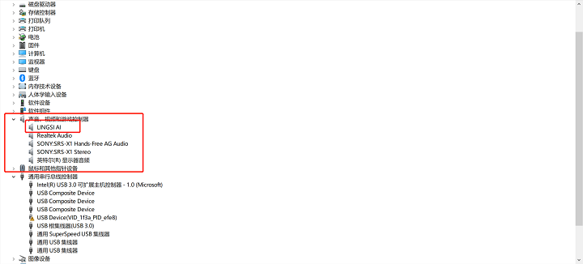

# 常见问题

## 基础功能开发

### 1.常用Lisa命令
**编译：** 
- Lisa build 完整编译
- Lisa task build：respak 编译respak包
- Lisa task build：package 将bin文件打包成lpk烧录包

**烧录：** 
- Lisa flash 完整lpk包烧录
- Lisa flash -p master/respak 单独烧录bin文件
当仅修改respak或者master时，可单独烧录bin文件

**示例：** 
修改adc增益后烧录：
- 修改adc_gain参数并保存
- Lisa task build：respak
- Lisa task build：package
- Lisa flash -p respak
- 重启机器

### 2.Lisa项目源码在哪里？
项目根目录\node_modules\@source\csk4002\source

### 3.Lisa项目source源码编译后如何在Lisa项目打包？
1. 需要将4002nc source文件拷贝到其他目录下，修改后双击build.bat脚本进行编译，编译生成master.bin，路径：\out\target\master.bin
2. 将编译生成的master.bin替换Lisa项目根目录下的target\building\master.bin文件
3. 在LStudio终端使用Lisa task build:package进行lpk打包
4. 使用Lisa flash 进行烧录

### 4.如何设置设备输出音量的最大值和最小值
电脑端的音量0--100与castor设备代码的对应关系：

函数 task_i2s_spk.c中

```
#define SPK_VOL_DB_MAX (0.0f)
#define SPK_VOL_DB_MIN (-25.f)
```
>说明：
>SPK_VOL_DB_MAX为castor可以输出的音量最大db值。对应电脑音量调到100时。
>SPK_VOL_DB_MIN为castor可以输出的音量最小db值。对应电脑音量调到0时。

这两个值需要根据具体喇叭硬件的能力来确定。默认是 最大输出0db，最小输出-25db。


### 5.Lisa flash命令无法烧录，如何解决？
1.首先确认castor的设备是否能够被电脑正常识别


2.若设备驱动正常识别仍无法使用Lisa flash进行烧录，请提取报错信息通过工单系统反馈给聆思。

### 6.IO口需要设置为上拉输入需要怎样设置？
1.IO状态：
```
// GPIO direction
#define NDS_GPIO_DIR_INPUT             0x0
#define NDS_GPIO_DIR_OUTPUT            0x1
```
2.代码中的示例：
```
void
factory_check_enter_init(void)
{
		int pin = 0;
		int mux = 0;

		// factory check enter pin initailize
		pin = factory_config.check_enter.pin;
		factory_set_pin_as_gpio(pin);

		// set direction in
		mux = io_mux_table[pin].mux;
		if (mux &lt; 2) {
			driver_gpio_table[mux]-&gt;SetDir(1 &lt;&lt; io_mux_table[pin].num, NDS_GPIO_DIR_INPUT);
			driver_gpio_table[mux]-&gt;Control(
NDS_GPIO_MODE_PULL_NONE, 1 &lt;&lt; io_mux_table[pin].num);  // pull none
		} else {
			CLOGE("PIN(%d) INIT ERROR", pin);
		}
}
```

### 7.I2S音频输出格式（以4002为例）：

- csk：master
- 上位机：slave
- mclk：4.096MHz
- bclk：2MHz(2.048MHz)
- lrclk：16KHz
- LRCLK左右声道各2个音频通道，每个通道位深32bit，通道12为mic原始音频，高24位有效，通道34为降噪后音频数据，高16位有效。


### 8.PA9作为普通IO口无法控制？
1.hardware.lini去掉pin18 IO配置   
2.在#include "pin_mux.c"里增加：    
```C
void
gpio_init_add(void)
{
	int pin = 18;
	IOMuxManager_PinConfigure(io_mux_table[pin].mux, io_mux_table[pin].num, NDS_IOMUX_FUNC_DEFAULT);
	driver_gpio_table[0]-&gt;SetDir(1 &lt;&lt; io_mux_table[pin].num, 1);
	driver_gpio_table[0]-&gt;PinWrite(1 &lt;&lt; io_mux_table[pin].num, 1);
}
```

3.在main.c里调用pin18初始化
```C  
hardware_init{
...
  adc_init();  // ADC initialize
   gpio_init_add();
}
```

4.gpio控制：  
pin_mux.c    

```C
void sys_PA9_ctrl(bool high_low)
{
	bool ret;
	CLOGI("gpio_ctrl PA9 %d", high_low);
	driver_gpio_table[0]-&gt;PinWrite(1 &lt;&lt; io_mux_table[18].num, high_low);
}
```

```C
	if (key_value == 1) {
		key_value = 0;
		sys_PA9_ctrl(true);
	} else {
		key_value = 1;
		sys_PA9_ctrl(false);
	}

```
### 9.如何修改设备名称
**步骤1** 
```c
在/config/application.lini中修改如下字段(若无则增加)：
uac_desc_name = "LINGSI AI"
```
```c
  [hw_config.usb_mode]
  uac_in_enable = true
  uac_mode = "both"
  uac_in_channel = 3
  custom_enable = false
  uac_desc_name = "LINGSI AI"
```
**步骤2** 
编译烧录
**步骤3** 
卸载驱动后重新插入设备。


