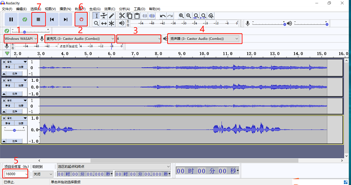
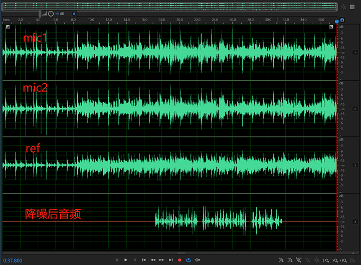
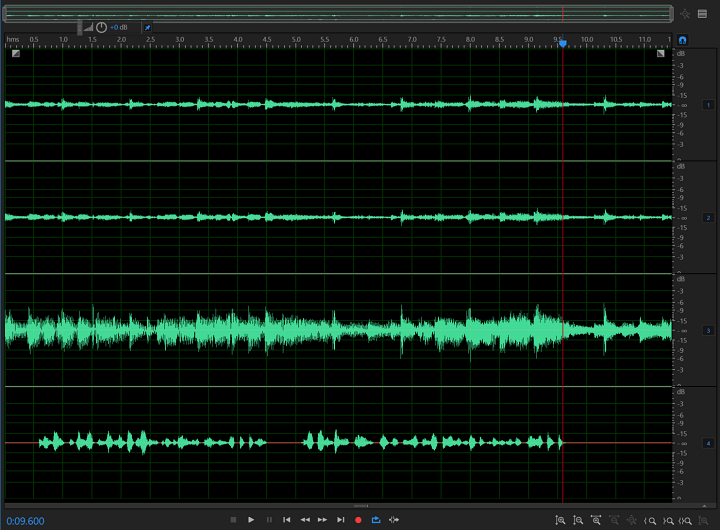
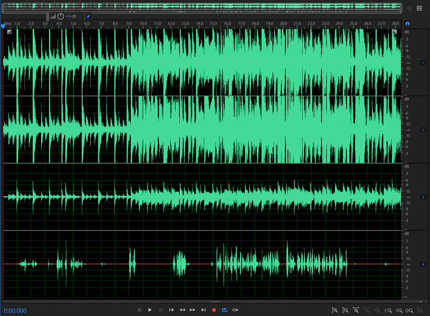
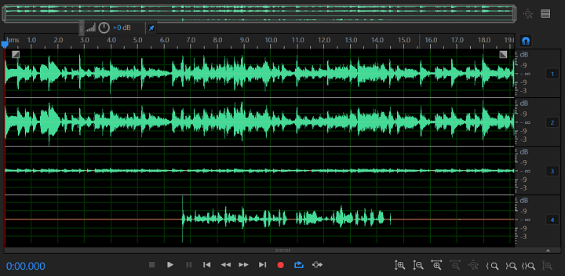
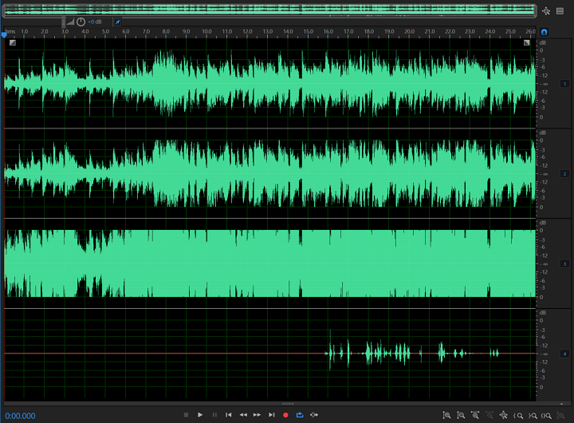
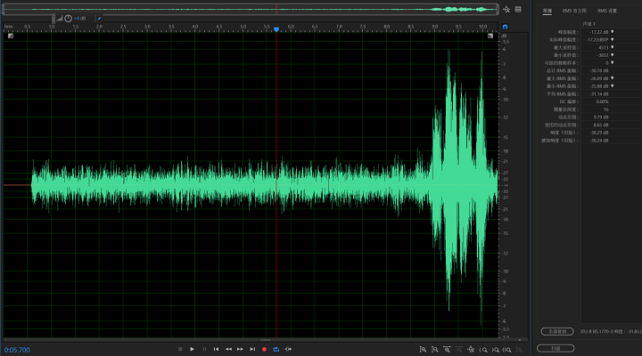

# 设备调优

### 1.常用Lisa命令
**编译：** 
- Lisa build 完整编译
- Lisa task build：respak 编译respak包
- Lisa task build：package 将bin文件打包成lpk烧录包

**烧录：** 
- Lisa flash 完整lpk包烧录
- Lisa flash -p master/respak 单独烧录bin文件
当仅修改respak或者master时，可单独烧录bin文件

**示例：** 
修改adc增益后烧录：
- 修改adc_gain参数并保存
- Lisa task build：respak
- Lisa task build：package
- Lisa flash -p respak
- 重启机器


### 2.如何设置设备输出音量的最大值和最小值
电脑端的音量0--100与castor设备代码的对应关系：

函数 task_i2s_spk.c中

```
#define SPK_VOL_DB_MAX (0.0f)
#define SPK_VOL_DB_MIN (-25.f)
```
>说明：
>SPK_VOL_DB_MAX为castor可以输出的音量最大db值。对应电脑音量调到100时。
>SPK_VOL_DB_MIN为castor可以输出的音量最小db值。对应电脑音量调到0时。

这两个值需要根据具体喇叭硬件的能力来确定。默认是 最大输出0db，最小输出-25db。

### 3.如何修改mic增益和回采增益

```c
/config/application.lini
```

当前增益参数值:

```json
adc_gain = [ 7, 7, 2, 2 ]

参数说明：
第一个参数，MIC1 增益，有效范围：1-10（数值越大增益越高，0 表示关闭）
第二个参数，MIC2 增益，有效范围：1-10（数值越大增益越高，0 表示关闭）
第三个参数，REF1 增益，有效范围：1-10（数值越大增益越高，0 表示关闭）
第四个参数，REF2 增益，有效范围：1-10（数值越大增益越高，0 表示关闭）
```


    在不同设备上调试 MIC 和 REF 增益的时候，设备自播最大声音（激昂音乐或讲话稿）时录音幅值范围：
    大概保持 mic 录音幅值 -3db~-15db
    大概保持 ref 录音幅值 -3db~-15db
    
    注意：
    若出现 mic 截幅后者 ref 截幅，效果都会变差；
    若 mic 录音增益过小，会造成 AGC 压力很大，听感单薄，音量小。


### 4.修改4002NC源码编译后如何放到Lisa项目中打包？
- 修改4002NC源码并编译生成master.bin，路径：\out\target\master.bin
- 将编译生成的master.bin替换Lisa项目根目录下的target\building\master.bin文件
- 在LStudio终端使用Lisa task build:package进行lpk打包
- 使用Lisa flash 进行烧录

### 5.如何修改设备名称
**步骤1** 
```c
在/config/application.lini中修改如下字段(若无则增加)：
uac_desc_name = "LINGSI AI"
```
```c
  [hw_config.usb_mode]
  uac_in_enable = true
  uac_mode = "both"
  uac_in_channel = 3
  custom_enable = false
  uac_desc_name = "LINGSI AI"
```
**步骤2** 
编译烧录
**步骤3** 
卸载驱动后重新插入设备。


### 6.如何对设备进行debug录音分析
**步骤1：准备 Debug 固件** 

对设备进行录音分析，需要烧录 debug 固件。

- 如何编译 debug 固件？
在4002NC源码根目录下运行 build-uac.bat 脚本进行编译，编译固件包即为 debug 版本固件。

- 按照本文第4章节“4.修改4002NC源码编译后如何放到Lisa项目中打包？”指导完成debug版本固件的烧录。

**步骤2：音频分析工具**

-   录音软件：[Audacity](https://pc.qq.com/detail/0/detail_640.html)

-   音频分析软件：[Adobe Audition CC](https://www.onlinedown.net/soft/1157792.htm)

> 音频检查可直接通过 [Audacity ](https://pc.qq.com/detail/0/detail_640.html)，也可以将 Audacity 导出的音频通过 [Adobe Audition CC](https://www.onlinedown.net/soft/1157792.htm) 查看。

**步骤3：录音**

将检查对象（产品/模组/开发板）通过 USB 连接电脑，使用录音工具进行录音，对录音音频质量进行检查。

-  **将检查对象（产品/模组/开发板）通过 USB 连接电脑;**

-   **PC 端播放音乐,将调试设备音量调到最大;**

    

- **打开录音工具 Audacity 并完成配置：**

  Audacity 界面配置如图标注，点击录音按钮开始录音。

  

  > 选择 Windows WASAPI、
  > 采样率 16000、
  > 录音麦克风和播放设备对应的 Castor Audio，声道为 4。

-  **录音完成后将音频导出为 wav 格式音频。**
    

**步骤4：音频分析**
**将增益调节到参考音频幅值。**


    说明：
    第 1 路为 mic1 信号，信号幅值峰值在-3db~-15db 之间，符合录音幅值要求；
    第 2 路为 mic2 信号，信号幅值峰值在-3db~-15db 之间，符合录音幅值要求；
    第 3 路为 ref2 信号，信号幅值峰值在-3db~-15db 之间，符合录音幅值要求；
    第 4 路为降噪后信号。是最终输出给上位机的音频。


### 7.如何增强AGC效果

- AGC增益：
```c
m_targetGain = 6_000
m_MaxGain = 10_000
```
调节m_targetGain 和 m_MaxGain，增大agc增益。
m_targetGain 建议不要超过16000；
m_MaxGain 建议不要超过22000。

- AGC放大系数：
```c
m_AGC_Upbound = 12
m_AGC_Lowbound = -12
```
调节m_AGC_Upbound和m_AGC_Lowbound参数，增大AGC放大倍数。
m_AGC_Upbound 建议不超过12；
m_AGC_Lowbound 建议不超过-12。

### 8.样机调试步骤
**步骤1.硬件结构检查**

- 震动检查
1. 设备壳体自身部件间震动（比如螺丝没紧固好）。
2. 内部线缆部件等震动。
3. 设备内关键器件是否有软垫防震

- 气密性检查
检查设备气密性，腔体内是否有漏音。

- 环境检查
调优或测试的时候，避免设备旁边是有大面积硬质物体遮挡反射，或者避免设备在纸张上、旁边有塑料袋。

**步骤2.确定speaker音量**

- 根据客户需求设定喇叭输出音量最大值，可播放1KHZ 0db音频，在0cm距离测量音量分贝。

**步骤3.录音音频检查**

- 麦克风录音/回采录音
录音幅值：设备最大音自播自录mic录音和回采音频不截幅。

**步骤4.降噪后音频效果确认**

- 回声消除效果
- 自动增益效果
- 环境噪声抑制

**参考音频**

[示例音频下载](files/音频示例.wav)

### 9.常见问题分析

#### 9.1 MIC 录音幅值过小

**音频表现：**

最大音量播放音乐条件下，录制的音频声音幅度过小，听不清楚录音的内容，在 2 米外的人声录音几乎听不清楚。通过录音查看可发现 MIC1，MIC2 的幅度远低于-3db~-15db。



**解决方案：**

通过调整 ADC 增益解决。

调整方向：
增大 mic 增益值。
经过多轮调节测试最终确定将 ADC mic 增益参数调整为：

```json
    adc_gain = [ 7, 7, 2, 2 ]
```

#### 9.2 MIC 录音幅值过大（出现截幅）

**音频表现：**

最大音量播放音乐条件下，录音出现截幅现象。



**解决方案：**
调整增益。

调整方向：
减小 mic 增益值。
经过多轮调节测试最终确定将 ADC mic 增益参数调整为

```json
    adc_gain = [ 7, 7, 2, 2 ]
```

#### 9.3 回采录音过小

**音频表现：**

回采录音信号幅值低于-3db~-15db,且远低于 mic 信号幅值，回采信号幅值过小会影响回声消除效果。



**解决方案：**
调节增益。

调整方向：
增大 ref 增益值。
经过多轮调节测试最终确定将 ADC ref 增益参数调整为：

```json
    adc_gain = [ 7, 7, 2, 2 ]
```

#### 9.4 回采录音过大（出现截幅）

**音频表现：**

最大音量播放音乐条件下，回采录音信号幅值高于-3db~-15db,并出现截幅。



**解决方案：**
调整增益。
调整方向：
增大 ref 增益值。
经过多轮调节测试最终确定将 ADC mic 增益参数调整为：

```json
    adc_gain = [ 7, 7, 2, 2 ]

```

#### 9.5 音频失真

音频失真表现：
降噪后音频出现电音、模糊、卡顿等现象，与音源有明显差异。
示例：
音频波形正常，但音频播放模糊不清，存在失真现象。
[示例音频下载](files/录音异常.wav)

若发现音频失真，请通过工单反馈：[工单指引](https://open.listenai.com/cloud_project)

#### 9.6 音频底噪

底噪表现：
安静环境下，录音底噪>-35db,存在明显底噪。



[示例音频下载](files/录音异常.wav)

**底噪来源分析：**

-   硬件电路底噪
    排查方法：拔掉 mic 进行录音测试，如果存在底噪则说明底噪来自硬件电路。
-   mic 本身拾音带来底噪
    排查方法：排除硬件电路底噪后，mic 原始录音即存在明显底噪，则可判断为 mic 录音底噪。通常由于麦克风灵敏度等问题导致底噪。
-   算法处理后产生底噪
    排查方法：排除硬件底噪和 mic 本身拾音产生底噪后，音频通过算法处理后有明显底噪，则可判断为算法处理后产生了底噪。

> 注意事项：
> 需要在安静环境下进行测试，并排除空调、风扇、固定噪声等音源的影响。

**底噪解决方案**

-   硬件电路导致底噪
    排查硬件电路，确定底噪干扰源。
-   mic 本身拾音带来底噪
    更换优质 mic 解决底噪问题。
-   算法产生底噪
    请通过工单反馈：[工单指引](https://open.listenai.com/cloud_project)

#### 9.7 回声消除效果差

**回声消除效果差音频表现：**

安静环境下进行录音分析，与标准音频对比，算法处理后音频能明显听到设备自播残留声音。

示例音频：
[示例音频下载](files/回声消除效果差.wav)

**解决方案：**

-   确定 mic 音频和回采音频已经达到幅值参考要求；
-   确定 mic 录音音频是否存在失真问题,录音无明显异常；
-   确定 ref 音频是否存在失真问题,录音无明显异常；
-   以上问题都排除之后问题仍存在，请通过工单反馈：[工单指引](https://open.listenai.com/cloud_project)。
