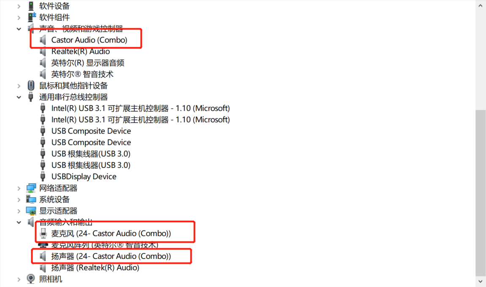
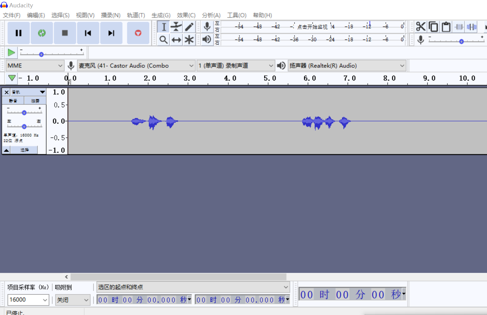

# 使用 LISA 创建 4002NC 项目

## 获取LISA环境[#](https://open.listenai.com/lisa_create#获取lisa环境)

下载并安装LStudio 最新版本，即可以完成配置所有运行 LISA 所需的环境配置。[点击这里下载](https://castor.iflyos.cn/castor/v3/lstudio/download)

如果之前已经在更早版本的 LStudio 登录过，安装新版本后**请重新登录**。


**检查 LISA**
1. 在 LStudio 打开终端
2. 输入命令行 `lisa -v`，看到 LISA 版本号，代表 LISA 环境正常
```shell
PS C:\Users\oralzl\项目文件夹> lisa -v
@listenai/lisa/1.3.4 win32-x64 node-v12.21.0
```

## 使用 LISA 命令行创建 4002NC 项目

接下来正式介绍如何使用  `lisa create` 命令创建 4002NC项目

### 选择创建项目的路径 

`lisa create` 会在当前命令行所指定的路径创建项目。所以在创建项目之前请使用 `cd` 命令指定路径。

```shell
PS C:\Users\oralzl\> cd E:\FAE资料
PS E:\FAE资料> 
```

### 输入创建命令

命令示例：`lisa create newProject -t @generator/csk`

- `newProject` 代表项目文件夹名称，可自定义。仅支持英文、数字与下划线
- `-t` 代表使用模板（template）创建项目
- `@generator/csk` 是CSK语音交互项目的标准模板

输入创建命令之后，创建模板会提供架手架配置项目所需其他软件包。

```shell
PS E:\FAE资料> lisa create NcProject -t @generator/csk 
  √ 项目创建准备
  √ 初始化安装依赖
? 选择芯片方案 @source/csk4002nc
? 选择基础固件版本 4.2.4
✔ 创建csk开发项目目录/文件
✔ 安装源码
? 选择板型模版 @board/kaisuda-csk4002nc
? 选择算法模型 @algo/csk4002nc-cae-mlp
✔ 安装必要依赖
✔ 源码初始化
✔ lskit配置准备
✔ 算法配置准备
```

完成项目创建之后，请使用 LStudio 打开新的项目。

### 项目结构简介

 **`.\config` 文件夹含有项目所需要的配置文件，包括:**
- `application.lini` 与固件源码配套的应用配置
- `hardware.lini` 硬件引脚配置文件
- `interact.lini` 语音交互配置(4002NC项目无需配置)
- `keywords.lini` 唤醒词/命令词阈值配置(4002NC项目无需配置)
- `tones.lini` 提示音配置(4002NC项目无需配置)

**`alias` 与 `thresholds` 文件夹已移动到 `deps` 文件夹中**

**`.\.lisa` 文件夹会记录 lisa 产生的日志**

**`package.json` 可以看到项目中的相关依赖**
```
{
	"name": "NcProject",
	"version": "1.0.0",
	"description": "",
	"author": "",
	"license": "ISC",
	"lisa": {},
	"dependencies": {
		"@algo/csk4002nc-cae-mlp": "^1.0.0",
		"@board/kaisuda-csk4002nc": "^1.0.0",
		"@generator/csk": "^2.0.5",
		"@listenai/lisa_core": "^2.0.4",
		"@source/csk4002nc": "~4.2.4"
	}
}
```
## 配置 4002NC LISA 项目

通过 `lisa create` 创建的新 NC 项目，并完成以下项目配置。

### application 配置

- 支持对 `application.lini` 进行配置

  找到相关配置项,修改adc_gain参数

```
    [driver.codec.adc]
    adc_type = "es7210"
    adc_gain = [ 7, 7, 2, 2 ]
    mic_chs = [ 1, 2 ]
    ref_chs = [ 3, 3 ]
```
### source code 模式配置 
- 支持对 `firmware_module_config.mk` 进行配置
  在项目中找到firmware_module_config.mk文件进行模式配置

**firmware_module_config详情如下：**
```
# --------------- config start --------------- #

# NC项目debug模式，即输出4路音频  0：不打开调试  1：打开调试
SELECT_UAC_DEBUG ?= 0

# NC项目切换喇叭的驱动类型   0：clsd，  1：I2S
SELECT_SPK_DRIVER_TYPE:= 1

# 用于4002/3002项目，切换正常的播音功能/usb私有的调试录音功能  0：播音    1：调试录音
SELECT_USB_PRI_REC:= 0

# 用于4002NC项目，切换16K采样或48K采样 0：16K  1: 48K
ENABLE_I2S_48K_SAMPLE:= 0

# 用于4002NC项目，切换CAE后的数据传入到的哪一路i2s  0：CAE用i2s dout0输出 UAC用dout1输出  1：CAE用i2s dout1输出 UAC用dout0输出
SELECT_CAE_I2S_ID:= 1

# ---------------- config end ---------------- #

```
## 固件构建与烧录

### 使用 LISA 构建固件

在当前项目中，打开命令行终端，输入 `lisa build` ，触发固件构建流程。

```shell
PS E:\FAE资料\NcProject> lisa build
  √ 固件编译
  √ 编译respak.bin
  √ 打包lpk包
```

**LPK 文件是最终构建产物，可用于 LISA 烧录**

### 使用 LISA 烧录固件

**烧录前准备**
- 安装驱动：可点击 LStudio 顶部工具栏-常用工具-安装驱动
- 准备数据线：确保数据线可以用于数据传输


**烧录流程说明**

在当前项目中，打开命令行终端，输入 `lisa flash` ，触发固件烧录流程。

关于 LSKits的相关操作，可以参考[这份文档](https://open.listenai.com/getting_start#25-%E5%9B%BA%E4%BB%B6%E7%83%A7%E5%BD%95)。

```shell
PS E:\FAE资料\NcProject> lisa flash
bin list > flashboot(0),master(0x10000),respak(0x100000)
[-]等待设备进入烧录模式...
烧录分区 1｜ ████████████████████████████████████████ | 64.00 KB/64.00 KB | flashboot(0)
烧录分区 2｜ ████████████████████████████████████████ | 336.79 KB/336.79 KB | master(0x10000)
烧录分区 3｜ ████████████████████████████████████████ | 2874.91 KB/2874.91 KB | respak(0x100000)        
烧录完成
```

## LISA 4002NC 体验

### 确认驱动安装

在电脑上插入USB，打开电脑设备管理，确认如下:



### 通话体验
通过PC端会议软件进行通话效果体验。

### 录音

安装录音软件：[Audacity](https://pc.qq.com/detail/0/detail_640.html):

选择对应的录音设备录音如下：



