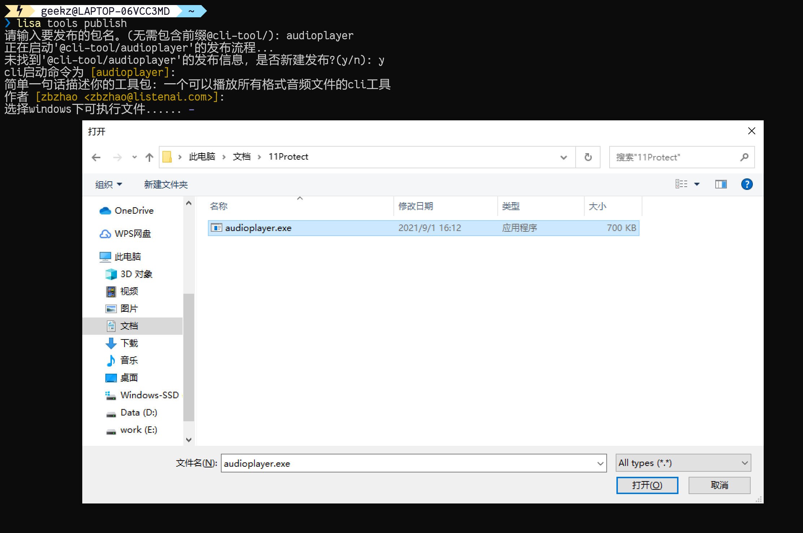
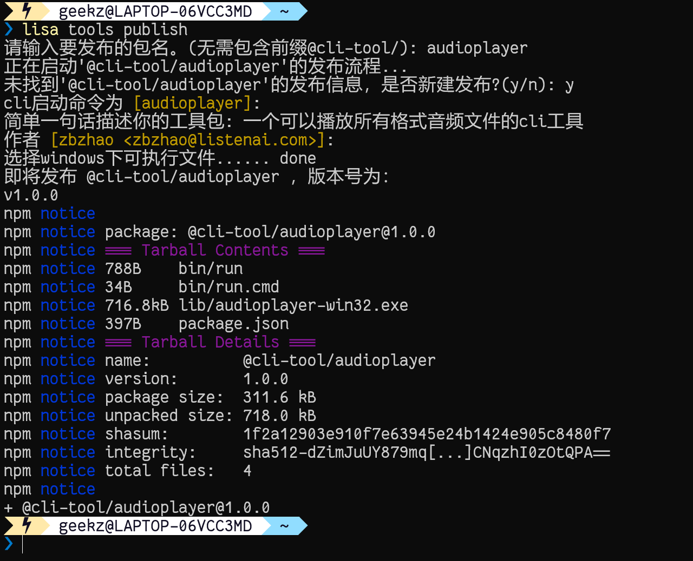

:::info

该功能仅在 v2.1.0 或以上版本具备

:::

为方便使用更自由的命令行工具包，并基于lisa强大的版本管理，新增lisa的命令行工具包管理命令。

该篇文档主要介绍，如何一步步 **发布/更新** 自己的命令行工具包。

## 全新发布

假设当前我有一个在windows下播放音频的命令行可执行工具。

### 1、执行命令行工具包发布命令。

```sh
lisa tools publish
```

### 2、输入我的包名

注意无需填写包名前缀 **@cli-tool/** ，lisa会自动帮忙补全。

如下图例子，我发布一个播放音频的命令行可执行工具，因此包名就叫 **audioplayer**


:::info

包名是唯一的，格式为 @cli-tool/xxx，可在[lpm官网](https://lpm.listenai.com/lpm/)查询是否已存在。

:::

### 3、确认是否为新建发布


### 4、输入工具的启动命令

十分重要!!!为使用者在命令行使用该包的cli命令，如下图所示，当使用者安装了该工具包，在终端执行的命令则为

```sh
audioplayer
```


:::info

同样为唯一，若为新建发布，则默认值为**步骤2**的包名，回车即可。

:::

### 5、输入工具包的描述


### 6、输入发布作者

默认值为你当前的lisa登录的账号。


### 7、选择windows下可执行文件

会弹出系统的文件选择器，选择你的cli可执行文件即可。



### 8、发布！

这一步等待发布就可以了~



## 更新发布

与全新发布一样，步骤1、2均一致。

若当前lisa登录的账号有该工具包的发布权限，会进入版本号的更新提示：


|  选项   |  描述  |
|  ----   |  ---- |
| major  | 重大的变更，版本号会自动第一位加1，其余位变0，比如 2.1.3 -> 3.0.0 |
| minor  | 较小的变更，比如新增一些功能，版本号会自动第二位加1，比如 2.1.3 -> 2.2.0 |
| patch  | 一些补丁，比如bugfix，版本号会自动第三位加1，比如 2.1.3 -> 2.1.4 |

后续步骤也跟全新发布一致。

## 内置命令

lisa已为所有cli工具包内置了两个常用的命令，开发者无需再自行实现。

以上述 **@cli-tool/audioplayer** 为例

1、查看版本

```sh
audioplayer --version
```

2、版本更新

```sh
audioplayer --update
```