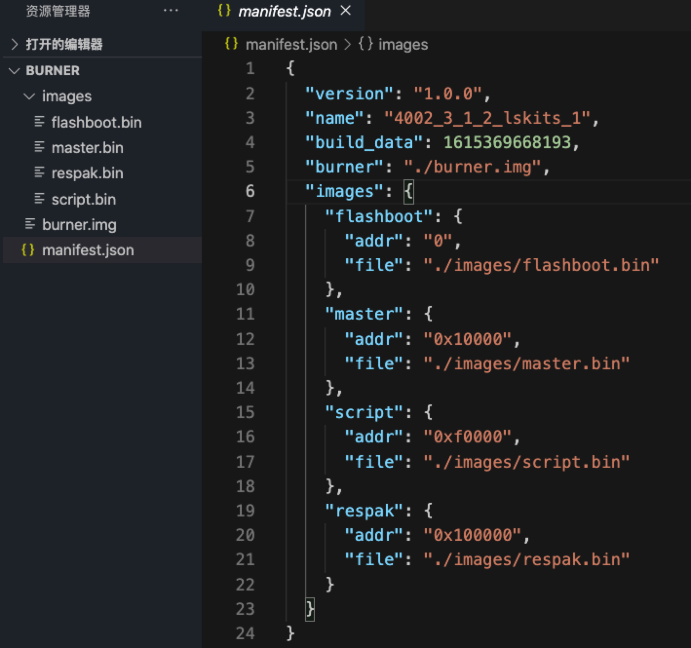

<p style={{color: "#6d6d6d", fontSize: "24px"}}>阅读该教程不需要你预先掌握任何 lisa 知识。</p>

## 课前准备

我们将会在这个教程中开发一个小工具包。你将在该教程中学到如何使用lisa去创建并开发实现一个lpm包，以及使用者如何使用该lpm包。掌握这些知识后，你将初步了解到lisa的一些功能和使用。

你也可以跟着该课程的完整[`视频教程`](https://www.bilibili.com/video/bv1Pb4y1X7qY)进行学习。

:::info

这篇教程适用于更喜欢边学边做的开发者，如果你更喜欢从头开始学习一些概念，请参考lisa相关的命令和api文档。

:::

这篇教程分为以下几个部分：
- 环境准备

### 我们会做出什么东西？

背景：lisa框架内置了能够跨平台的固件烧录命令，可烧录的固件类型是.lpk。但非lisa创建的csk项目，打包出来的固件并不能被lisa进行烧录。
<br/>
接下来，我们一起用lisa来开发一个工具包，用于帮助非lisa创建的csk项目，打包出.lpk类型的固件包，以此能够使用lisa的烧录。

## 环境准备

完成这篇教程有两种方式：可以直接在LStudio中开发，也可以在你电脑上搭建lisa的开发环境。

### 方式一：在LStudio中进行开发（推荐）

这是上手最快的一种方式了！LStudio内置了所有所需要的环境以及开发工具。我们也强烈推荐你直接使用LStudio来进行开发。

如果你选择这种方式，就可以跳过方式二，直接阅读教程啦。

### 方式二：搭建本地开发环境

如果你因为其他原因无法安装LStudio，你可以按照下列步骤进行搭建本地开发环境：

1、确保你安装了较新版本的Node.js。

2、全局安装yarn。

```shell
npm install yarn -g
```

3、全局安装lisa。

```shell
npm install @listenai/lisa -g
```

4、配置LISA_ACCESS_TOKEN环境变量。

<ShowToken></ShowToken>

import BrowserOnly from '@docusaurus/BrowserOnly';

export const ShowToken = ({children, color}) => {
  
  return (
    <BrowserOnly
      fallback={<div>The fallback content to display on prerendering</div>}>
      {() => {
        // Something that should be excluded during build process prerendering.
        function getCookie(cname){
          var name = cname + "=";
          var ca = window.document.cookie.split(';');
          for(var i=0; i<ca.length; i++) 
          {
            var c = ca[i].trim();
            if (c.indexOf(name) == 0) return c.substring(name.length,c.length);
          }
          return "";
        }
        const token = getCookie('token')
        return (
          <span>你的LISA_ACCESS_TOKEN为：{token}</span>
        )
      }}
    </BrowserOnly>
  )
};

<br/>
<br/>

现在，运行下lisa的命令看看吧～

```shell
lisa -v
```

## 开发一个lisa包

### 创建lisa包

执行下面命令，跟着命令引导提示，你能得到一个具有lisa包基础目录结构的项目。
```shell
lisa create newLib --template @generator/lpm-pkg
```

执行下面命令，开发运行
```shell
cd newLib
npm run start
```

没有异常的话，你已经创建了一个初始的lisa包，并成功运行起来。

:::info

lisa 更多的命令介绍和使用可以在lisa文档中查阅。创建项目时的模板生成器，也可在lpm库进行查找。

:::

### 阅读初始代码

用LStudio打开刚创建的项目，打开package.json。该文件描述的是当前lisa项目的所有信息。想了解lisa项目的package.json更多信息，请查阅lisa的相关文档。
```json
{
  "name": "你的lisa项目名，如果是lisa包，建议以@scopeName/libName表示，如`@generator/lpm-pkg`",
  "version": "版本号，采用语义化版本 (semver) 规范。格式为：主版本号.小版本号.修订版本号，如`0.0.1`",
  "description": "项目描述",
  "author": "项目作者",
  "license": "项目开源许可类型。默认为`ISC`。",
  "lisa": {
    "configPath": "lisa项目的config配置文件的路径。初始为:`./lib/config.js`",
    "taskPath": "lisa项目的task任务文件的路径。初始为:`./lib/task.js`"
  },
  "main": "项目的入口文件。初始为:`./lib/index.js`",
  "scripts": "可npm run的命令",
  "publishConfig": {
    "registry": "发布该项目的目标仓库地址。默认为:`https://registry-lpm.listenai.com`。"
  },
  "files": "发布时包含的文件目录。数组格式，初始为`['lib','assets']`",
  "keywords": "项目的关键字。数组格式。",
  "dependencies": "项目的依赖库",
  "devDependencies": "项目开发环境下的依赖库"
}
```

在初始项目，需要关注的代码文件是，src目录下的config.ts、index.ts、task.ts这三个文件。当执行`npm run start`或`npm run build`时，会编译到./lib目录下。

1、./src/config.ts文件，在执行lisa命令时，会加载该配置，并在这次命令的整个运行时中都能够被引用。

2、./src/task.ts文件，在执行lisa命令时，会加载该任务，并在这次命令的整个运行时中都能够被引用。

3、./src/index.ts文件，是项目的入口文件，可供其他js/ts文件引用。比如在开发lisa的generator包时，该文件会被使用到。本教程暂不涉及该文件的编写。

### 注册你的第一个task

task是通过一个job()函数进行注册，该函数入参有两个。
- cmdName — 任务名称，字符串类型，必须是类似 build:pre 的名称；请注意，如果任务名称相同，不可知道任务是否会被替换，推荐使用 {包名}:{任务名}的命名规范
- obj — 任务对象，object类型。

任务对象是一个object类型，同样有两个必须的key。
- title - 执行task时控制台显示的title，传入字符串
- task - 执行该task时的业务逻辑，传入一个方法

```typescript
job('oldBuild:package', {
  title: '打包lpk包',
  task: async (ctx, task) => {
    // 编写你这个task会执行的逻辑
  },
})
```

按照上面的代码，改写下你的./src/task.ts。如果你没有执行`npm run start`，先执行`npm run start`，这个命令会监听./src目录的所有更改，重新编译。然后执行下面命令

```shell
lisa task oldBuild:package
```

当你看到`打包lpk包`这个title，恭喜你，你已经注册了一个task，并成功执行它了！

### 编写task逻辑

我们的目的是生成一个lpk包，能够让lisa对它进行烧录。首先一个lpk包，其实文件类型是一个zip文件，里面包含了烧录时所需要的bin文件和配置。下图是一个lpk包所包含的文件，以及配置文件的内容。



所以我们的task需要实现的是，生成这份manifest.json配置文件，以及将对应的bin文件，打成一个zip包。

```typescript
// ./src/task.ts

import * as lisa from '@listenai/lisa_core'
import PackageLpk from './common/package-lpk'

export default ({job, fs, application, ...core} = lisa) => {
  job('oldBuild:package', {
    title: '打包lpk包',
    task: async (ctx, task) => {
      const _packageLpk = new PackageLpk(application)
      await _packageLpk.start()
    },
  })
}
```

下面文件只铺了关键的业务逻辑代码。
```typescript
// ./src/common/package-lpk.ts

// lisa_core是Lisa框架的核心库，该库封装了很多实用的api功能以及lisa运行时的配置参数调用方法。具体可移步到lisa_core的文档查阅。
import {fs} from '@listenai/lisa_core'

export default class PackageLpk {
  _application: Application;
  _zip: any;
  constructor(application: Application) {
      this._application = application;
  }

  async start() {

    // 定义几个bin文件的来源路径
    // const buildTargetPath = "非lisa创建的csk项目的固件输出目录: `target/build`"

    // 先初始化该manifest配置，对应的version、name需要额外去查找。
    const manifest = {
      "version": "build_version",
      "name": "name",
      "build_data": new Date().getTime(),
        "burner": "./burner.img",
        "images": {
            "flashboot": {
                "addr": "0",
                "file": "./images/flashboot.bin"
            },
            "master": {
                "addr": "0x10000",
                "file": "./images/master.bin"
            },
            "script": {
                "addr": "0xf0000",
                "file": "./images/script.bin"
            },
            "respak": {
                "addr": "0x100000",
                "file": "./images/respak.bin"
            }
        }
    }

    // lisa_core的fs有export zip的方法，对应api请参考lisa_core的相关文档查阅。
    this._zip = fs.project.zip()

    this._addLocalFileToZip(buildTargetPath, 'flashboot')
    this._addLocalFileToZip(buildTargetPath, 'master')
    this._addLocalFileToZip(buildTargetPath, 'script')
    this._addLocalFileToZip(buildTargetPath, 'respak')

    this._zip.addFile(
        'manifest.json',
        Buffer.from(JSON.stringify(manifest, null, '\t'))
    )

    this._zip.addLocalFile(path.join(__dirname, '../../assets/burner.img'))
    this._zip.writeZip(this._getDebugLpkPath('burner.lpk'))
  }

  _addLocalFileToZip(buildTargetPath: string, key: string) {
    if (!fs.existsSync(path.join(buildTargetPath, `${key}.bin`))) {
      throw new Error(`缺少固件的必要资源文件:${key}.bin`)
    } else {
      this._zip.addLocalFile(path.join(buildTargetPath, `${key}.bin`), 'images')
    }
  }

  _getDebugLpkPath(fileName: string) {
    return path.join(this._application.context.oldBuild.debugLpkPath, fileName)
  }

}
```

可以看到上面代码_getDebugLpkPath这个方法，读的是application.context.oldBuild.debugLpkPath。该context参数是会在整个lisa命令的运行时里存在，该配置要在config中去定义。

```typescript
// ./src/config.ts

import * as lisa from '@listenai/lisa_core'
import * as path from 'path'

module.exports = ({application, fs, ...core} = lisa) => {
  // 更多applicaton的用法，请到核心库文档查阅 https://open.listenai.com/lisacore/index.html
  application.configuration(config => {
    config.addContext('oldBuild', {
      // application.root是执行命令的根目录
      debugLpkPath: path.join(application.root, 'target/output/debug')
    })
  })
}

```

这时，一个task基本完成。该lisa包的相关源码，可以直接点击下载查阅。

## 发布你的lisa包

经过上一章节，你已经完成了自己的一个lisa包，下面我们来将它发布到lpm库吧！

修改好你的包名和版本号，执行下面命令:
```shell
lisa publish
```
:::warning

仓库名如果与他人重复，发布会失败噢！建议修改一个特别的包名～

:::

恭喜你，你已经成功发布了一个lisa包！

## 加课！尝试来使用该lisa包吧

发布了一个自己的lisa包，让我们来使用试试看吧！

由于该课程的lisa包的task，是将非lisa创建的csk项目打包出lpk包，请先在Lstudio创建一个csk项目(不要用lisa进行创建哦)，或者打开你已有的非lisa创建的csk项目。

执行以下命令，将该csk项目初始化成一个能够使用lisa框架的项目。
```shell
lisa init
```

然后安装我们刚刚的lisa包
```shell
// 这里的包名是你刚刚发布的包名
lisa install @tool/csk-old-build
```

安装成功后，通过lisa命令查看这个包的task是否被加载到了
```shell
lisa task -T
```

如果成功加载到，那么恭喜你，你能看到你的任务名称出现在控制台的输出里。

这时，需要非lisa创建的csk项目成功打出一个固件，再执行该task

```shell
lisa task oldBuild:package
```

如果该task也执行成功，尝试用lisa进行烧录吧！

```shell
lisa flash
```

## 结语

恭喜你！你已经完成入门课程，能够独立创建开发一个lisa包，并发布到lpm库，以及使用自己的lisa包。

干的不错！我们希望你至此已经基本掌握开发一个lisa包的整体流程了。更多的开发者高阶操作教程，可以查阅其余文档哦。