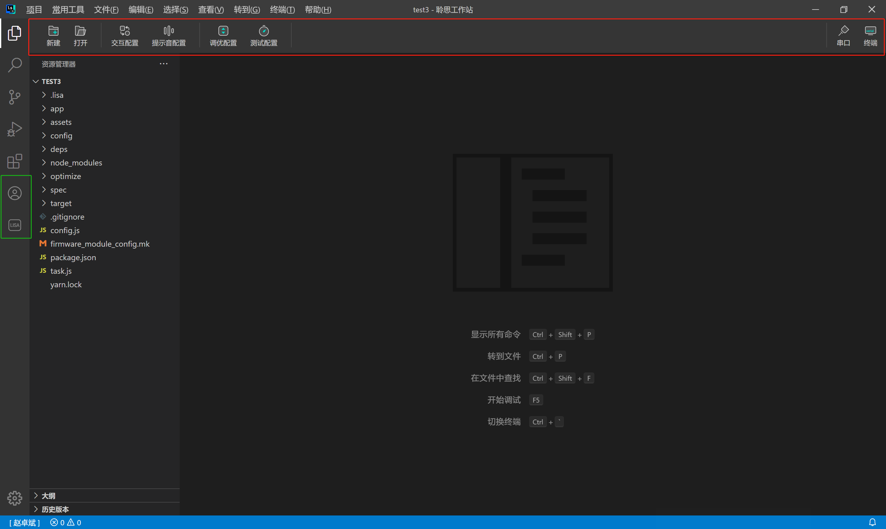

# 用户界面

LStudio是基于 Visual Studio Code 的编辑器IDE。因此使用习惯和布局基本与 Visual Studio Code 保持一致。

如图为VS Code基础布局，LStudio保持了该布局的同时，基于其增加额外的个性化布局。

## 基本布局

基本的UI分为五个区域：

- 编辑器 - 编辑文件的主要区域。您可以在垂直和水平方向并排打开任意数量的编辑器。
- 侧边视图栏 - 包含不同的视图，如资源管理器，可在您处理项目时为您提供帮助。
- 状态栏 - 有关打开的项目和您编辑的文件的信息。
- 集合栏 - 位于最左侧，可让您在视图之间切换，并为您提供其他特定于上下文的指示器，例如启用 Git 时传出更改的数量。
- 面板 - 您可以在编辑器区域下方显示不同的面板，用于输出或调试信息、错误和警告，或集成终端。面板也可以向右移动以获得更多垂直空间。

每次启动 LStudio 时，它​​都会以与上次关闭时相同的状态打开。文件夹、布局和打开的文件将被保留。

:::info

如果想了解更多关于VS Code的用户界面相关内容，可点击[此处](https://code.visualstudio.com/docs/getstarted/userinterface)查阅。

:::

## 个性化布局

LStudio在不破坏基本布局的原则上，根据聆思开发者的常用行为，并按较好的操作体验，进行分类改造出一些个性化的布局。

- 快捷功能栏 - 如图红框标记的，里面包括了日常使用时较为常用的功能，并会根据不同类型的工程项目，铺展不同的常用功能快捷按钮。

- 侧边集合 - 如图中绿框标记的，目前主要为用户的账号操作，以及Lisa的命令集合。
