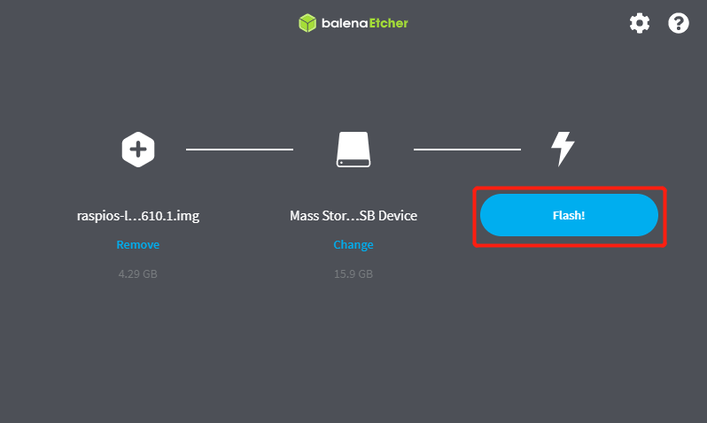
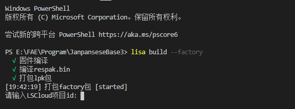
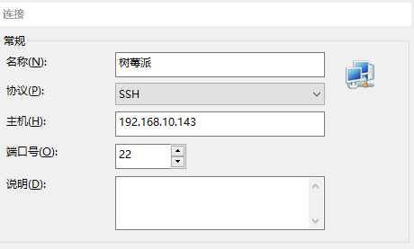
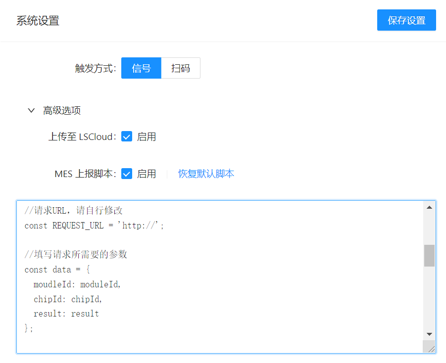
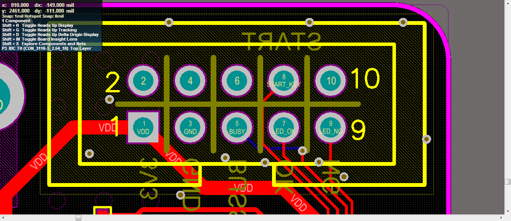
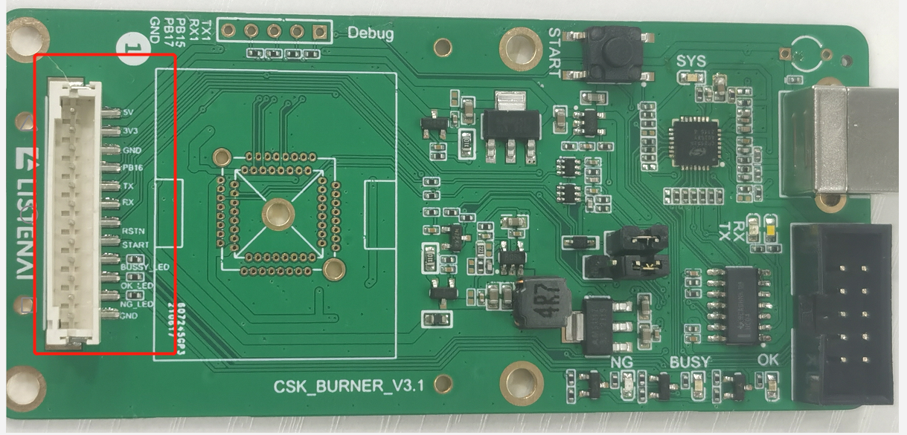
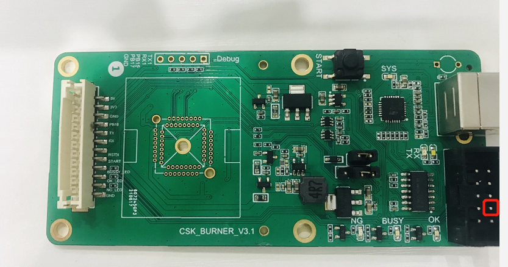

# CSK烧录器V3

## 1 烧录器使用指引

### 1.1 烧录器简介

CSK烧录器是面向聆思代理商、方案商等合作伙伴，可配合烧录机台、治具进行裸芯片烧录、模组烧录的工具。

CSK烧录器V3 基于烧录器2.1版本增加了对聆思新发布CSK6芯片系列的支持，同时进一步完善了已有功能，提升使用体验。

聆思合作伙伴可依据本文档配置烧录器，并配合烧录机台实现一拖多自动化芯片烧录与板载烧录。

### 1.2 功能亮点
- 支持CSK全系列芯片固件烧录

  适配CSK4、CSK6等全型号的芯片烧录与板载

- 提升烧录效率

  支持1拖多烧录，8M固件仅需50s即可烧录完成

- 烧录过程可追溯

  支持烧录日志上传，可追溯烧录任务详情。

- 烧录管理便捷

  采用树莓派作为烧录控制主机，固件管理与更新更简易，支持高级功能配置。

### 1.3 使用方法简介

- 将树莓派上电，待蓝色指示灯开始闪烁后，表明固件加载完毕；
- 将待烧录的芯片置入烧录座或将烧录串口板连接待烧录的PCBA；
- 按下烧录串口板上的按键开始烧录，烧录结束后，底板将以红/绿灯显示烧录结果。

烧录器框图如下：

<div  align="center"></div>

#### 工厂使用案例

- **芯片烧录**

  ​树莓派作为烧录器的控制设备，将烧录器搭载于烧录机台上，启动烧录机台。机械臂将芯片放置在烧录座子中，烧录器自动开始烧录。烧录结束后，烧录器将烧录结果通过电平信号传递给机台。接到烧录结果后，机台机械臂自动更换芯片，开始下一轮烧录。详细接线与实现方法请查看[2.3软硬件调试](/tools/mass_production/cskburner#硬件接法)。

<div  align="center"></div>

<div  align="center"></div>

- **模组(板载)烧录**
  
  将树莓派作为主控设备，通过Hub（烧录器在4个以上时需要Hub）连接烧录串口板，串口板接口与待烧录的CSK模组相连接，按下烧录板上的开关键或拉低start信号即可开始烧录，详细接线与实现方法请查看[2.3 软硬件调试](#软硬件调试)。


### 1.4 维护与报废规范

说明：为提高芯片烧录时，烧录座子的烧录效果和良率，拟以下烧录座子维护和报废原则。

**维护规范：**

- 每次使用前使用汽枪吹干净每个座子。

- 使用结束后需把所有烧录座上的芯片取出。

- 每天结束烧录后把烧录座倒过放置，或者使用盖板盖住烧录座，避免进入粉尘影响接触。

**报废规范：**

- 查看日志系统，确认该烧录座的使用次数是否已经达到5000次。

- 当烧录座连续出现3PCS芯片不良，查看系统日志均为设备打开失败导致。

- 使用能烧录OK的芯片手动测试，发现还是无法烧录，日志为打开设备失败。

- 观察烧录座前5脚（如下图），如果针脚有明显的位移，可尝试使用镊子将针脚复位修复，修复后可以手动测试烧录座，烧录10次有8次能通过则可继续上机使用，否则报废。


## 2 烧录器配置指引

如需配置烧录器，请依照以下指引配置软、硬件，并完成联调。

### 2.1 硬件配置

#### 2.1.1 硬件设计资料

本节提供烧录器硬件设计资料和验收测试标准。

**硬件设计资料**

烧录串口板：[CSK_LOAD V2.1.rar](http://pan.iflytek.com:80/#/link/010457DE846A8D7C3E6D8E21AF131BA2) (访问密码：n5Op)

点击以上链接即可获取硬件框图、原理图、PCB、BOM

图例：

<div  align="center"></div>
<div  align="center"></div>

**验收标准**

烧录串口板回板后，请按照以下表格进行验收测试，以免电压或掉电时序等不符合要求导致烧录器不稳定。

 [烧录器验收测试模板.xlsx](http://pan.iflytek.com:80/#/link/010457DE846A8D7C3E6D8E21AF131BA2) (访问密码：n5Op)

测试报告样例如下：

 [烧录器验收测试案例.xlsx](http://pan.iflytek.com:80/#/link/010457DE846A8D7C3E6D8E21AF131BA2) (访问密码：n5Op) 

#### 2.1.2 其他配件与规格要求

- CSK4芯片烧录座子板：[CSK_LOAD_adapter.rar](http://pan.iflytek.com:80/#/link/010457DE846A8D7C3E6D8E21AF131BA2) (访问密码：n5Op)

- CSK4芯片烧录座（请根据USB转串口板子数量确定烧录座子数量）：如无特殊需求，推荐使用PLASTRONICS烧录座子，规格参见[烧录座子封装_64LQ50S19090.pdf](http://pan.iflytek.com:80/#/link/010457DE846A8D7C3E6D8E21AF131BA2) (访问密码：n5Op) 

- CSK6芯片烧录座子板/CSK4芯片烧录座规格：敬请期待

- 1*树莓派4B

- 1*TF卡：≥16G

- USB2.0打印线 (如图：一头是USB, 另外一头是小方口，数量与烧录板数量保持一致) ：线长≤0.5m：

<div  align="center"></div>

- Hub（可选，1拖4及以下不需要配置）：京东购买链接：https://item.m.jd.com/product/62280475705.html?gx=RnFiwGFdPDeLwtRP--tzVUaeLn90-OEAjYN0&ad_od=share&utm_source=androidapp&utm_medium=appshare&utm_campaign=t_335139774&utm_term=Wxfriends

:::info 注意

Hub可能会影响烧录稳定性，请谨慎选择，如无特殊需求请按以上链接购买。

:::

### 2.2 软件配置

#### 2.2.1 将烧录程序写入TF卡

- 用读卡器将TF卡插入电脑

- 下载镜像：[raspios-lsfactory.xxxxxxxx.img.7z](http://pan.iflytek.com:80/#/link/010457DE846A8D7C3E6D8E21AF131BA2) (访问密码：n5Op)，并解压

- 使用 `balenaEtcher`（以管理员身份运行）将镜像烧写到 TF 卡

   balenaEtcher下载链接：[balenaEtcher](https://www.balena.io/etcher) （windows请选择Windows X86|x64版本）

  

  下图表示烧写成功：
  
  
  
:::tip 提示 
  
如烧录失败，请更换读卡器或更换USB口重新烧写，多次重试。
  
:::

#### 2.2.2 制作烧录包（LPK包）

烧录前需要将带烧录的业务固件打包为LPK包。LISA和非LISA项目需采用不同的打包方法。

若您的项目属于**CSK4**的LISA项目，在固件完成调试与量产前确认后，打开LStudio项目，在LStudio终端输入

```sh
lisa build --factory
```

若您的项目属于**CSK6**的LISA项目，在固件完成调试与量产前确认后，在工程目录的终端输入：
```sh
lisa zep lpk
```

  如图：

  

  输入正确的LSCloud项目ID和名称，即可生成烧录所需的lpk包。

如果您的项目属于非LISA项目，请打开以下文档链接，并依照操作文档说明打包LPK包

  [烧录包制作工具](/tools/Mass_Production/WebTools/pack)


#### 2.2.3 配网并获取局域网IP

- 将烧写了镜像的TF卡插到电脑上，将[wpa_supplicant.conf](http://pan.iflytek.com:80/#/link/010457DE846A8D7C3E6D8E21AF131BA2) (访问密码：n5Op) 复制到出现的 boot 分区中，如图：


export const Highlight = ({children, color}) => (
  <span
    style={{
      color: color,
}}>
    {children}
  </span>
);

- 将文件中的“<Highlight color="#1877F2">Wi-Fi名称</Highlight>”和"<Highlight color="#1877F2">Wi-Fi密码</Highlight>"分别替换为调试现场或工厂的WiFi名称和密码。

  修改示例：

```txt

ctrl_interface=DIR=/var/run/wpa_supplicant GROUP=netdev
country=CN
network={
    ssid="LINGSI"
    scan_ssid=1
    psk="LS$123456#"
    key_mgmt=WPA-PSK
}
```

- 退出磁盘并将 TF 卡插到树莓派上电。

- 获取树莓派的IP：点击下载[IP_browser.exe](http://pan.iflytek.com:80/#/link/010457DE846A8D7C3E6D8E21AF131BA2) (访问密码：n5Op) ，在windows电脑打开exe程序，等一会儿，即可查看当前内网下的所有树莓派的IP地址。如获取失败，请确认TF卡中烧录的是否是最新镜像，如不是，请联系聆思FAE。

:::tip 提示

联网成功后该文件会自动消失。如需更换WiFi，重新在boot分区中新建一个`wpa_supplicant.conf`即可，重新上电后原配网信息会被覆盖。

:::

:::info 

可通过SYS灯的快慢确认树莓派是否联网，详情可见[指示灯说明](#指示灯说明)。

:::

#### 2.2.4 上传LPK包
打开浏览器(推荐使用Chrome谷歌浏览器)，在地址栏输入 http://xxx.xxx.xx.xx:8080/upload 并回车。(请将此处的xxx.xxx.xx.xx替换为上个步骤获取的树莓派的局域网IP)，即可访问烧录工具的WEB管理页面。

点击上传固件，选择计划烧录的LPK包，进行上传，上传完毕后，可过此页面对烧录固件管理与配置，如图：


<div  align="center"></div>

:::tip 提示

固件上传后，系统会对固件包进行检查，如果固件包出现异常，系统也将给予对应提示，进根据提示进行处理或联系聆思FAE。

:::


#### 2.2.5 其它

**登入树莓派**

登入树莓派后，您可查看本地日志、手动更新树莓派的烧录软件版本。

**方法1**（现场须备有键盘和带有标准HDMI接口的显示器）：

首先将树莓派与键盘、显示器相连接，其次给树莓派上电，输入用户名与密码登录树莓派（默认用户名为pi，密码为raspberry）。登录成功后，即可输入命令行

**方法2**：SSH连接

- 首先保证电脑与树莓派连接同一个路由器，在同一个局域网中。

- 获取树莓派在内网的IP地址

  - 获取方式1：按照以上方法1中的步骤在显示器上打开树莓派终端，执行

    ```sh
    ifconfig -a
    ```

    即可查看树莓派的内网IP

    

  - 获取方式2：参照前面使用[IP_browser.exe]获取IP的方式。

- **连接方式1**：下载安装Xshell并打开，点击新建会话，选择SSH协议，并将IP地址填写在主机一栏，点击连接即可

  

- **连接方式2**：打开Windows Powershell（请保证Win OpenSSH已添加到环境变量），执行以下命令

  ```sh
  ssh pi@192.168.10.143
  ```

  注意：pi@后的IP地址仅作示例，请手动替换为您的树莓派对应的IP地址

  输入密码登录树莓派（初始密码为raspberry）

  


**对接Mes系统接口**

如工厂需要将烧录结果上传Mes系统，可依照以下操作步骤对接Mes系统：

- 在WEB管理页面，点击【高级选项】→ 勾选【MES上报脚本】启用，若需使用扫码枪，请将触发方式选择为【扫码枪】(如工厂将Chip ID作为芯片/模组的唯一识别码，不使用扫码枪，保持触发方式为【信号】即可)：
如图：


- 在【MES上报脚本】下方的脚本编辑框中配置Mes系统请求URL、请求所需参数等信息并保存，如图



:::tip 提示

点击右侧【恢复默认脚本】，可重置Mes配置脚本为初始状态。

:::

完成以上配置后，扫码枪扫描模组条形码，将触发烧录（如触发方式为【信号】，则烧录方式仍为按键触发烧录）；烧录结束后，烧录结果将上传到指定的Mes系统http内网接口，并接收返回值。如上传失败，USB转串口板将显示红灯，此时请重试，或根据以下常见错误类型排查http连接问题：

  - 不在同一局域网
  - 请求的url地址，或者方法错误 404
  - 请求的参数问题 400
  - 有鉴权相关问题 401
  - mes系统自身接口的处理问题 5xx

### 2.3 软硬件调试

本章介绍如何跑通烧录流程、与烧录机台或治具配合使用。

软、硬件均按照2.2中的步骤配置完成后，可连接烧录器与树莓派进行调试

#### 硬件接法

- 用USB2.0打印线连接树莓派与烧录串口板，或将Hub插入树莓派USB接口，用USB2.0打印线连接Hub与烧录器，如图：

<div  align="center"></div>


- **芯片烧录**

  - 按下树莓派开关启动树莓派，自检固件、量产固件加载成功后，蓝色指示灯闪烁，表示烧录器已准备就绪；如按下开关后树莓派启动，但USB转串口板无灯光亮起，说明固件异常，可根据[日志查看方法](#日志查看方法)排查

  - 将芯片左上角的小圆点对准烧录器中的圆形标识`1`，用镊子或静电笔将芯片放置在烧录座子中

  

- **模组烧录**

  - 通过烧录板的接口将模组（或治具接线）与烧录板相连接，
    
    - 必须接通的引脚有：PB16、GND、TX、RX
    
    - 可选择接通的引脚：5V（建议外接5V给模组供电）、3.3V、RSTN、START、BUSSY_LED、OK_LED、NG_LED

- **USB转串口底板接口说明**

  - 接口1（芯片烧录机台信号线、治具可通过该接口中的引脚与烧录器相连接）：

    

    | <center>烧录器接口</center> | 对应信号（低电平有效） |
  | :----------: | :--------: |
  | Pin1       | VDD |
  | Pin3       | GND |
  | Pin5       | Busy Signal |
  | Pin7       | OK Signal |
  | Pin8       | START Signal |
  | Pin9       | NG Signal |
  | Pin2、Pin4、Pin6、Pin10 | 备用 |

  - 接口2（引脚对应信号见丝印）：

    

    将烧录器通过信号线连接烧录机台的效果图如下：

  

    烧录机台自动化烧录过程：完成硬件连接后，等待蓝色状态指示灯闪烁，才可以执行机械臂并发送烧录信号，开始烧录；烧录完成后，如机台收到烧录器发送的OK信号，则机械臂取走芯片，放置下一片芯片；如机台收到烧录器发送的NG信号，则机械臂取走芯片再按压到烧录座子中，重新烧录；如连续烧录2或3次（可在机台上设置该次数）均NG，则机械臂取走芯片并放置在特殊区域

#### 烧录方法

- 方法1：拉低图示引脚（接GND），即可发送start信号，开始烧录

   

- 方法2：按下图示中的按键，即可发送start信号，开始烧录

  <div align="center"></div>

- 等待一段时间后（两分钟内），如烧录器显示绿灯，则检测通过、烧录完成，调试成功；如烧录器显示红灯，代表检测不通过或烧录失败，建议打开日志查看问题，或更换芯片重试

#### 日志查看方法

- 方法一：首先登入树莓派，登入方法见本文档[2.2 软件配置](#软件配置)中的[登入树莓派](#登入树莓派) ，在默认路径下（/home/pi）执行以下命令即可打开日志：

  ```sh
  ./factory/logs.sh
  ```
图例：

  图中标识处为需要烧录的固件的信息：

   <div  align="center"></div>

  图中标识处为自检固件的频率信息：

   <div  align="center"></div>

  图示表示烧录成功：

   <div  align="center"></div>

- 方法二：将树莓派联网，烧录日志会上传到您制作芯片烧录包时填写的LSCloud项目中。使用PC打开[LSCloud网页](https://cloud.listenai.com/)，进入该LSCloud项目，点击左侧边栏`日志`，并设置正确的时间区间，即可在烧录完成后查看烧录日志，如图：

<div  align="center"></div>

:::caution 注意：

未联网状态下，烧录日志将存放在树莓派本地，联网后可上传日志。如树莓派长期未联网，将删除部分本地日志，避免本地日志占满磁盘。故强烈建议烧录前将树莓派联网。

:::
  
#### 关机方法

需要关机时，请先短接树莓派右侧第3和第5引脚（如图），维持短接状态直到USB转串口板上所有的指示灯熄灭（短接至熄灭约需等待10s时间，熄灭后树莓派的风扇仍在工作），再按下树莓派的按钮开关断电。
<div  align="center"></div>

:::danger 注意！

直接断电可能会导致TF卡损坏。

:::

#### 附：烧录失败原因排查

|                      <center>日志显示的失败原因</center>                      |                         <center>建议排查方向</center>                         |
| :---------------------------------------------------------- | :---------------------------------------------------------- |
|                       自检固件加载失败                       | /boot/LISTENAI/factory_config目录下的factory.lini设置的自检固件名称与/boot/LISTENAI/selfcheck_lpks目录下存放的自检固件名称不一致，请依照[2.2.2 第4节 设置自检固件](#设置自检程序)中的步骤重新设置 |
|量产固件资源与配置文件MD5不一致|量产烧录包中的资源文件（.bin）的MD5和配置文件（.json）分区表中的MD5不一致，请确认打包LPK后是否人工修改过配置文件或资源文件，如有，请使用[芯片烧录包制作工具](/tools/Mass_Production/WebTools/pack)重新打包|
|                设备打开失败，无法进入烧录模式                | 说明硬件连接失败，建议检查烧录座与芯片引脚是否接触不良，芯片是否放置错误，并按[2.1.1 硬件设计资料](#验收标准)中的验收标准确认烧录板验收测试通过 |
| 自检失败，0x00 \| 自检失败，0x01 \| 自检失败，0x02 \| 自检失败，0x03 \| 自检结果读取超时 | 先确认是否已按[2.1.1 硬件设计资料](#验收标准)中的步骤做完烧录板验收测试；如已验收，可检测引脚接触、供电稳定情况，如调整后仍自检失败，可尝试更换芯片验证 |

##### 指示灯说明

  

- 标记“0”蓝灯每隔0.5s闪烁一次，表示树莓派处于联网状态，自检程序与量产固件加载成功，准备就绪，等待烧录
- 标记“0”蓝灯每隔2s闪烁一次，表示树莓派处于未联网状态，自检程序与量产固件加载成功，准备就绪，等待烧录
- 标记"1"黄灯闪烁，表示正在烧录
-  标记“2”红灯亮起，表示烧录失败
- 标记“3”绿灯亮起，表示烧录成功
- 绿灯、蓝灯、红灯一同亮起，表示自检程序或量产固件加载异常，请依照[附：烧录失败原因排查](#附：烧录失败原因排查)进行分析排查
- 所有灯处于熄灭状态，表示烧录主控程序、自检程序、量产固件异常或树莓派处于关机状态，可以断电

### 可选：校验固件是否成功烧录

固件烧录后，可按照[芯片烧录包校验工具](/tools/Mass_Production/WebTools/verify)中的步骤校验固件是否成功烧录到芯片中。

## 3 治具规范

为避免模组损坏，要求烧录治具对 PCBA 测试点增加防护器件，主要的线路包括 TX、 RX、LOAD（PB16）、模块供电电源接口，可能还存在和上位机控制CSK上电使能脚和上位机的本身的使能脚。

- 串口：建议治具顶针上的TX、RX线路上增加 ESD 管到地。

- 电源接口：此部分主要针对对电源部分的引脚，此处对治具上的电源顶针上建议增加TVS管到地。

- LOAD引脚： CSK 3系列和4系列 PB16 脚（61 脚）在治具上对应的顶针上建议增加单向的 TVS 管到地。其它测试需要的IO口，如果在 PCBA上没有串接电阻和贴 ESD 时，建议在治具上对应 IO 的顶针上建议增加单向的TVS管到地。 

  - 待烧录的板子测试点处如有ESD防护措施，在工装上可以考虑不加

  - 背部探针后续建议统一采用连接小板形式，可以直接焊接，方便探针处就近放置TVS或ESD防护器件，同时避免在探针上连线引发的接触问题。如之前已做好的工装，添加手动焊接防护小板。

  - 针对信号IO接口，采用TVS管防护的同时，根据实际测试的波形需要做小电阻和小电容匹配，改善信号波形。 

  - 电源口一般建议采用 TVS 防浪涌管，串口建议采用ESD 管，LOAD采用对应 TVS管,如下表格推荐选型。

    | **位置使用** | **型号**                               | **推荐品牌** |
    | ------------ | -------------------------------------- | ------------ |
    | 电源 5V 接口 | TVS 浪涌管，  ST7VFHN162， DFN1610-2L  | 世晶         |
    | 串口         | ESD,SE5VFBN102， DFN1006-2L            |              |
    | LOAD和其它IO | TVS 浪涌管， ST4V5FBHN162， DFN1610-2L |              |


​        


