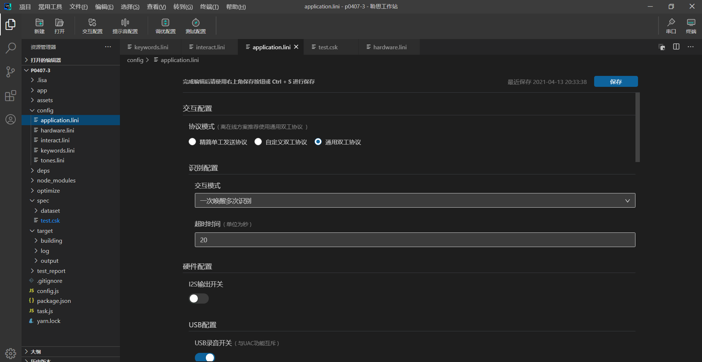

>本篇介绍如何在 `application.lini` 完成源码功能应用的配置。完全使用 `application.lini` 实现应用配置需满足以下条件：
1. 使用版本号 2.3.1 以上 LStudio 进行开发
2. 工程项目是使用 `lisa` 创建的 CSK 项目（文档参考：[使用 lisa 创建项目](/lisa_create)）

**温馨提示**： LStudio 旧项目的基础配置使用说明请查看：[CSK项目基础配置](/guides/firmware/base_config)

## 1 关于 application 文件

`application.lini` 是配合 CSK 固件源码实现功能配置的文件，每个系列的固件源码配置可能会有所区别。在使用 `lisa` 创建 CSK 项目过程中，会引用软件包 `@board/xxx` ，配置其中定义好的 `application.lini` 文件。

LStudio 会对 `application.lini` 中的可配置内容进行可视化渲染。**为了避免配置错误，推荐使用可视化界面完成配置的编辑。**如果想要查看配置源码，可以点击可视化界面右上角的切换按钮进行编辑模式切换。

## 2 交互配置

### 协议模式

| 选项 |  说明 | 
| - | - |
| 精简单工发送协议 | 可自定义的单工协议，支持串口/红外，推荐在演示demo或单工业务场景中使用。 | 
| 自定义双工协议 | 可自定义的双工协议，适用于双工业务场景。可在 `./app` 目录实现交互接口的选择和业务逻辑。 | 
| 通用双工协议 | 非自定义的双工协议，建议在离在线方案中使用。只支持串口通讯，不支持红外通讯。 参考：[CSK UART标准串口通信协议文档](/public_uart_protocol) | 

### 交互方式与超时时间

| 选项 |  说明 | 
| - | - |
| 一次唤醒多次识别 | 唤醒后可以连续进行多次识别，直到超时休眠。可配合设置超时时间。 | 
| 一次唤醒一次识别 | 唤醒后只进行一次识别，识别完成后进入休眠。无需设置设置超时时间。 | 

## 3 硬件配置

### I2S配置

目前只有 4002/4002nc 方案支持 I2S 音频输出。请根据业务需求设置是否打开 I2S 功能，并设置对应音频输出通道（音频通道最多支持配置4路）。

### USB配置

:::warning 务必预留引脚

CSK 芯片只预留了一组 USB 功能，对应引脚是 `pin4` 与 `pin5`。如果要使用 USB 功能。请务必保证 `hardware.lini` 配置文件中，`pin4` 与 `pin5` 没有被其他非 USB 功能占用。
:::

**功能说明**

- **UAC：**4002NC 方案必须打开 UAC 功能；4002 方案中 UAC 只能用于录音，不能输出音频。
- **USB录音：**多用于固件调试与效果测试过程中采集回放音频。**特殊说明：**3002 方案中，打开 USB 录音需通过修改源码实现。
- **互斥说明：**USB 录音功能与 UAC 功能 互斥，不能同时打开。

### 麦克风配置

| 配置项 |  说明 | 
| - | - |
| 麦克风类型 | 目前推荐使用模拟麦，若要使用数字麦请联系 FAE 进行咨询。 | 
| 麦克风间距 | 支持配置35-110mm，如果实际产品麦间距不在可选范围内，请选择一个最邻近的值。 | 

## 4 驱动配置

### UART配置

:::warning 务必配置对应引脚功能

CSK 芯片只预留了3组 UART 功能（端口编号分别为0、1、2）。请务必保证 `hardware.lini` 配置文件中，已经配置对应的引脚功能。
:::

| 配置项 |  说明 | 
| - | - |
| 通讯串口配置 | 用于上位机通讯，可选 UART 端口编号与通讯波特率。 | 
| 日志串口配置 | 可选 UART 端口编号，波特率固定为115200。 | 

### I2C配置

CSK 芯片只预留了2组 I2C 功能（端口编号分别为0、1）。请务必保证 `hardware.lini` 配置文件中，已经配置对应的引脚功能。

### ADC配置

| 配置项 |  说明 | 
| - | - |
| ADC型号 | 选择固件源码支持的ADC型号，固定支持一款则不显示可视化。 | 
| ADC增益配置 | 各路音频增益，数值越大增益越高，0表示关闭。 | 
| 麦克风通道配置 | 选择麦克风对应的ADC通道编号。 | 
| 参考信号通道配置 | 选择参考对应的ADC通道编号。 | 

:::note 增益调节注意事项：
1. 需要根据产品实际场景，通过录音分析（可使用Adobe Audition等工具），调整每个通道的增益；
2. 需要保证在设备播放最大音频时，每个通道的录音不会出现截幅问题；
3. 为了保证语音识别效果，在各通道录音不截幅情况下，需要尽量提高每个通道的增益。
:::

### 红外配置

**PWM驱动端口**与 **CH** 两个选项组合后，映射使用 `hardware.lini` 中对应的 PWM 功能。

| `application.lini` PWM端口选项 |  `application.lini` 选项 | `hardware.lini` 中对应的 PWM 功能 |
| - | - |- |
| pwm=0 | ch=1 | PWM_CH1 |
| pwm=0 | ch=2 | PWM_CH2 |
| pwm=0 | ch=3 | PWM_CH3 |
| pwm=1 | ch=0 | PWM_CH4 |
| pwm=1 | ch=1 | PWM_CH5 |

**其他配置项**

| 配置项 |  说明 | 
| - | - |
| 红外发射频率 | 支持设置为36000或38000。 | 
| 连续发送次数 | 连续发送次数。 | 
| 占空比 | 支持设置为1-255。 | 

## 5. 产测配置

产测相关的配置请阅读：[产测开发指南](/factory_config)

