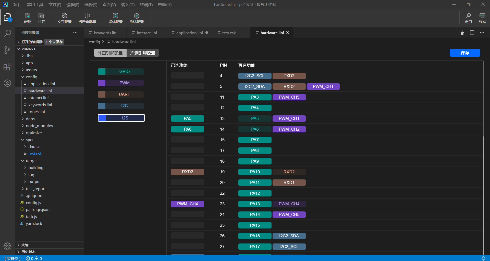

>本篇介绍如何在 `hardware.lini` 芯片引脚功能功能。使用 `hardware.lini` 完成配置需满足以下条件：
1. 使用版本号 2.3.1 以上 LStudio 进行开发
2. 工程项目是使用 `lisa` 创建的 CSK 项目（文档参考：[使用 lisa 创建项目](/lisa_create)）

**温馨提示**： LStudio 旧项目的引脚配置使用说明请查看：[外围引脚配置](/peripheral_config)

## 1 关于 hardware 文件

`hardware.lini` 用于定义芯片引脚功能，配合固件实现电控业务逻辑。LStudio 会对 `hardware.lini` 中的可配置内容进行可视化渲染。**为了避免配置错误，推荐使用可视化界面完成配置的编辑。**如果想要查看或直接修改配置代码，可以点击可视化界面右上角的切换按钮进行编辑模式切换。

## 3 支持的引脚与功能

- 支持配置与软件相关的芯片引脚
- 支持配置 `GPIO`、`PWM`、`UART`、`I2C`、`I2S` 等引脚功能
- 如果要使用芯片的 `USB` 功能，需保证 `pin4` 与 `pin5` 没有被其他功能占用，并在 `application.lini` 完成 `USB` 功能配置

## 4 配置可用性检测

图形化界面涵盖一系列规则检查，尽可能避免配置错误导致最终固件不可用，可放心使用：
- 渲染图形化前对当前配置进行检查。检查到配置错误进行报错提示，并提供一键恢复默认配置的选项
- 保证单个引脚只能配置一个功能
- 保证同个功能不被多个引脚重复配置
- 保证功能组合的完备性
- 保证 `GPIO` 功能所需的字段完备

## 5 与 application.lini 联动生效的配置

以下引脚功能需要 `application.lini` 中的相关配置才可以生效，在配置过程中请务必关注：
- [USB配置](/config_application#usb配置)
- [UART配置](/config_application#uart配置)
- [I2C配置](/config_application#i2c配置)
- [PWM-红外配置](/config_application#红外配置)

## 6 使用代码模式配置

如果想要查看或直接修改配置代码，可以点击可视化界面右上角的切换按钮进行编辑模式切换。推荐以下两种情况才使用代码模式：
1. 需要复用以往项目配置，可直接覆盖 `hardware.lini` 当前配置，可通过图形化渲染进行检查
2. 图形化配置无法满足当前需求，需要直接修改代码

`hardware.lini` 代码使用 TOML 语法实现，具体可参考：[外围引脚配置文档](/peripheral_config)

## 7 产测功能配置

`hardware.lini` 含有产测相关的配置，具体请阅读：[产测开发指南](/factory_config)

