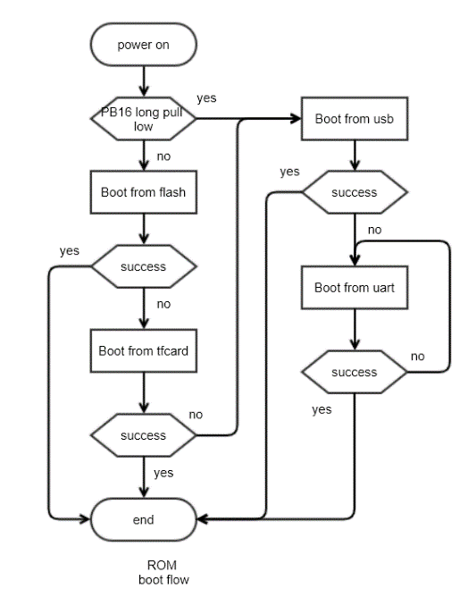
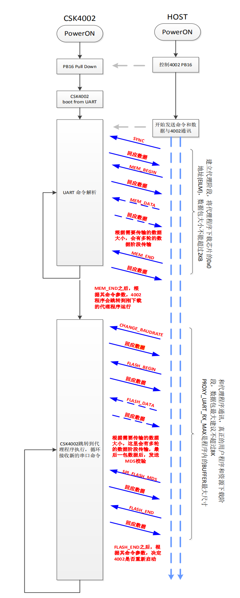

## 1.文档说明

本文档描述了CSK4002的串口下载方法，通过串口的方式，将用户代码拷贝到RAM或者FLASH区域，可用于用户方案开发，并开放上位机和下位机代码以及协议解析。

## 2.数据格式解析

数据格式较为简单，主机发送由SLIP转化的数据请求到CSK4002芯片，再由CSK4002数据芯片回应刚才的请求给上位机（SLIP协议转化），本章主要描述了请求格式、回应格式、错误码以及指令码四个方面的内容。

### 2.1底层传输协议

底层传输协议采用SLIP传输协议，包头和包尾均由0xC0包裹，中间数据区域的0xC0和0xDB将会替换为0xDB 0xDC 和 0xDB 0xDD。

### 2.2请求数据格式

| Byte| Name | Comment |
| ----| ---- | ---- |
| 0| Direction | 总是0x00 |
| 1| Command | 参考[指令列表](#26指令列表) |
| 2-3| Size | Data数据区域的长度 |
| 4-7| Checksum | 只有在FLASH_DATA 和 MEM_DATA两个指令有效，其他指令时都为0 |
| 8..n| Data | 数据传输区域，当在Command为FLASH_DATA 和 MEM_DATA时，该区域遵守Data协议，其他指令则都直接将数据按位放在该区域 |

### 2.3回应数据格式

| Byte| Name | Comment |
| ----| ---- | ---- |
| 0| Direction | 总是0x01 |
| 1| Command | 参考[指令列表](#26指令列表) |
| 2-3| Size | Data数据区域的长度 |
| 4-7| Value | 0x00 |
| 8| Error | 0x00表示成功，0x01表示失败 |
| 9| Status | 如果传输失败时候的失败原因，否则为0x00 |
| 10-17| MD5 | 只有当发送过来的Command为SPI_FLASH_MD5时该区域才有效 |

### 2.4错误状态码

| Name| Data | Comment |
| ----| ---- | ---- |
| TRANSMIT_PASS| 0x0 | 传输成功 |
| DATA_STREAM_OVERFLOW| 0x1 | 数据缓冲区溢出错误 |
| TRANSFORM_FORMAT_ERROR| 0x2 | 格式转化错误 |
| ILLEGAL_DATA_PACKET| 0x3 | 非法数据 |
| CHECKSUM_FAILED| 0x4 | 数据校验错误 |
| COMMAND_SEQUENCE_ERROR| 0x5 | 指令顺序错误 |
| DATA_ID_SEQUENCE_ERROR| 0x6 | 数据指令ID顺序错误 |
| FLASH_ERROR| 0x8 | FLASH写入错误 |
| UNSUPPORT_COMMAND| 0x9 | 未支持指令 |

### 2.5Data区域数据格式

| Byte| Name | Comment |
| ----| ---- | ---- |
| 0-3| Data Length | Data To Write区域的数据长度 |
| 4-7| Number | 从0开始的数据编号 |
| 8-15| 0|  |
| 16..n| Data To Write | 数据负载，最大负载为PROXY_UART_RX_MAX ROM通讯时则为 ROM_UART_RX_MAX|

 ### 2.6指令列表

 | Command| Data | Description | Input Data|
 | ----| ---- | ---- |---- |
 | FLASH_BEGIN| 0x02 | 开始FLASH下载 |总共4个WORD数据，分别为：总传输大小；传输PACKET数量；每个PACKET大小；起始地址（绝对地址） |
| FLASH_DATA| 0x03 | FLASH下载数据 |参考[Data区域](#25data区域数据格式) |
| FLASH_END| 0x04 | FLASH下载结束 |只有1个WORD数据 0x00：表示下载完成后下位机自动重启 0x02：表示下载完成后下位机仍然运行|
| MEM_BEGIN| 0x05 | 开始Memory下载 |总共4个WORD数据，分别为：总传输大小；传输PACKET数量；每个PACKET大小；起始地址（绝对地址） |
| MEM_END| 0x06 | Memory下载结束 |总共2个WORD数据，第一个WORD 0x00：表示下载完成后下位机自动重启 0x01：表示下载完成后跳转到第二个WORD数据的地址 第二个WORD只有在第一个WORD为0x01时有效 0x02：表示下载完成后下位机仍然运行|
| MEM_DATA| 0x07 | Memory下载数据 |参考[Data区域](#25data区域数据格式) |
| SYNC|0x08 | 同步 | 同步信号，总共36 WORD数据：0x07 0x07 0x12 0x20 在跟32个 0x55 |
| CHANGE_BAUDRATE| 0x0f | 改变波特率 |总共有2个WORD 参数，分别为改变的波特率；当前的波特率 |
| SPI_FLASH_MD5|0x13 | MD5校验 |总共有4个WORD参数，分别是：校验起始位置（绝对地址）；校验大小；0；0； |
| ERASE_FLASH| 0xd0 | 擦除整个FLASH | 无 |

## 3.传输过程

串口下载的整个过程，分为ROM通讯、建立代理、数据下载三个部分，每个部分都会涉及上一章提及的传输格式。

### 3.1ROM通讯

CSK4002芯片上电，会直接进入ROM程序，在ROM程序未检出FLASH上面有image文件时，会自动进入UART接收等待，具体逻辑见下图。

在ROM阶段发送SYNC指令，可以检查ROM是否进入UART等待接收阶段，这样便于后续的代理建立。

### 3.2建立代理

代理文件源码，见本文目录下的fireware文件夹，下载代理的目的在于将程序运行控制权，从ROM区域转移到代理区域，并支持FLASH下载，波特率切换，MD5校验等功能。

上位机可以通过发送MEM_BEGIN、MEM_DATA将代理文件发送至ROM侧，ROM UART接收代码会将该文件加载到SRAM区域，最后通过MEM_END，在发送结束的时候将程序的控制权完全交给代理。

### 3.3数据下载

当控制权完全由下载代理掌控后，指令列表里的所有指令都可以使用，用户可以在这个阶段进行FLASH下载，RAM下载，切换波特率，MD5校验等。

下面几节都会介绍各个指令的数据格式内容，但是都未进行SLIP处理，在实际数据发送的时候都需要进行SLIP处理，相关SLIP处理代码详见pc_tool文档内protocol目录下的slip文件夹。

#### FLASH下载

FLASH下载过程中，可以使用 FLASH_BEGIN、FLASH_DATA、FLASH_END三个指令。每发送一包数据，都需要上位机等待接收回应。

##### FLASH_BEGIN

| Byte| Name | Data |
| ----| ---- | ---- |
| 0| Direction | 0x00 |
| 1| Command | 0x02 |
| 2-3| Size | 0x00 0x18 |
| 4-7| Checksum | 0xXX 0xXX 0xXX 0xXX |
| 8-11| Total | 0xXX 0xXX 0xXX 0xXX（根据需要传输的数据量来定，无对齐要求） |
| 12-15| Packet Number | 0xXX 0xXX 0xXX 0xXX（需要传输的Packet数据量） |
| 16-19| Packet Size | 0xXX 0xXX 0xXX 0xXX（每一个Packet的负载大小） |
| 20-23| Address | 0xXX 0xXX 0xXX 0xXX（FLASH下载数据的起始地址，使用CSK4002芯片，该起始地址大于0x8000 0000 小于 0x8080 0000） |

该数据包只需要传输一次，将接下来需要传输的信息通知代理

##### FLASH_DATA

| Byte| Name | Data |
| ----| ---- | ---- |
| 0| Direction | 0x00 |
| 1| Command | 0x03 |
| 2-3| Size | 0xXX 0xXX |
| 4-7| Checksum | 0xXX 0xXX 0xXX 0xXX |
| 8-11| Data Length | 0xXX 0xXX 0xXX 0xXX（根据需要传输的数据量来定，无对齐要求） |
| 12-15| Number | 0xXX 0xXX 0xXX 0xXX（默认从0开始，每发送一个FLASH_DATA则加一，直到发送FLASH_END才清空） |
| 16-23| NULL | 0x0 |
| 24..n| Data To Write | 需要发送的数据 |

该指令会根据数据大小发送多次，每次该数据包的负载都是固定且不会特别巨大，避免因为数据错误导致重传浪费时间

##### FLASH_END

| Byte| Name | Data |
| ----| ---- | ---- |
| 0| Direction | 0x00 |
| 1| Command | 0x04 |
| 2-3| Size | 0xXX 0xXX |
| 4-7| Checksum | 0xXX 0xXX 0xXX 0xXX |
| 8-11| Flag | 根据需求发送，详见 指令列表 |

该指令只需要发送一次，发送完成及表示数据发送完成

#### RAM 下载

类似于FLASH下载，只是将FLASH_BEGIN、 FLASH_DATA、 FLASH_END换成MEM_BEGIN 、MEM_DATA、 MEM_END。

##### 波特率切换

| Byte| Name | Data |
| ----| ---- | ---- |
| 0| Direction | 0x00 |
| 1| Command | 0x0f |
| 2-3| Size | 0x00 0x10 |
| 4-7| Checksum | 0xXX 0xXX 0xXX 0xXX |
| 8-11| New | 0xXX 0xXX 0xXX 0xXX（需要更改的波特率） |
| 12-15| Old | 0xXX 0xXX 0xXX 0xXX（当前波特率） |

切换波特率需要注意的地方在于，该指令的数据发送和接收都依旧采用老的波特率，所以上位机需要在下位机回应完成后再切换当前波特率。默认的通讯波特率是115200，最高可以切换到3Mb的波特率。

##### MD5校验

| Byte| Name | Data |
| ----| ---- | ---- |
| 0| Direction | 0x00 |
| 1| Command | 0x13 |
| 2-3| Size | 0x00 0x18 |
| 4-7| Checksum | 0xXX 0xXX 0xXX 0xXX |
| 8-11| Address | 0xXX 0xXX 0xXX 0xXX（校验起始地址） |
| 12-15| Size | 0xXX 0xXX 0xXX 0xXX（需要校验的大小） |
| 16-19| 0 | NULL |
| 20-23| 0 | NULL |

## 4.通讯流程图

## 5.代理性能评估

<table>
   <tr>
      <th rowspan="3" align="center">含下载代理、无MD5校验</th>
      <th  align="center">波特率</th>
      <th  align="center">1M</th>
      <th  align="center">2M</th>
      <th  align="center">3M</th>
      <th  align="center">速度</th>
   </tr>
    <tr>
      <th  align="center">1536000</th>
      <th  align="center">24s</th>
      <th  align="center">42s</th>
      <th  align="center">60s</th>
      <th  align="center">21s/M</th>
   </tr>
   <tr>
      <th  align="center">3000000</th>
      <th  align="center">21s</th>
      <th  align="center">37s</th>
      <th  align="center">52s</th>
      <th  align="center">18.3s/M</th>
   </tr>
   <tr>
      <th rowspan="2" align="center">测试同上，传输大小为8K一包</th>
      <th  align="center">1536000</th>
      <th  align="center">20s</th>
      <th  align="center">33s</th>
      <th  align="center">46s</th>
      <th  align="center">16.5s/M</th>
   </tr>
    <tr>
      <th  align="center">3000000</th>
      <th  align="center">20s</th>
      <th  align="center">34s</th>
      <th  align="center">46-47s</th>
      <th  align="center">16.6s/M</th>
   </tr> 
    <tr>
      <th rowspan="3" align="center">含下载代理、MD5校验</th>
      <th  align="center">波特率</th>
      <th  align="center">1M</th>
      <th  align="center">2M</th>
      <th  align="center">3M</th>
      <th  align="center">速度</th>
   </tr>
    <tr>
      <th  align="center">1536000</th>
      <th  align="center">25s</th>
      <th  align="center">43s</th>
      <th  align="center">61s</th>
      <th  align="center">21.5s/M</th>
   </tr>
   <tr>
      <th  align="center">3000000</th>
      <th  align="center">22s</th>
      <th  align="center">37s</th>
      <th  align="center">53s</th>
      <th  align="center">18.67s/M</th>
   </tr>
   <tr>
      <th rowspan="2" align="center">测试同上，传输大小为8K一包</th>
      <th  align="center">1536000</th>
      <th  align="center"></th>
      <th  align="center"></th>
      <th  align="center">48s</th>
      <th  align="center"></th>
   </tr>
    <tr>
      <th  align="center">3000000</th>
      <th  align="center"></th>
      <th  align="center"></th>
      <th  align="center"></th>
      <th  align="center"></th>
   </tr>
    <tr>
      <th rowspan="3" align="center">不含代理、无MD5校验</th>
      <th  align="center">波特率</th>
      <th  align="center">1M</th>
      <th  align="center">2M</th>
      <th  align="center">3M</th>
      <th  align="center">速度</th>
   </tr>
    <tr>
      <th  align="center">1536000</th>
      <th  align="center">19s</th>
      <th  align="center">36s</th>
      <th  align="center">54s</th>
      <th  align="center">18.17s/M</th>
   </tr>
   <tr>
      <th  align="center">3000000</th>
      <th  align="center">17s</th>
      <th  align="center">32s</th>
      <th  align="center">47s</th>
      <th  align="center">16s/M</th>
   </tr>
   <tr>
      <th rowspan="2" align="center">测试同上，传输大小为8K一包</th>
      <th  align="center">1536000</th>
      <th  align="center"></th>
      <th  align="center"></th>
      <th  align="center">45s</th>
      <th  align="center">15s/M</th>
   </tr>
      <tr>
      <th  align="center">3000000</th>
      <th  align="center">16s</th>
      <th  align="center">29s</th>
      <th  align="center">42s</th>
      <th  align="center">14.5s/M</th>
   </tr>
    <tr>
      <th rowspan="3" align="center">不含代理、有MD5校验</th>
      <th  align="center">波特率</th>
      <th  align="center">1M</th>
      <th  align="center">2M</th>
      <th  align="center">3M</th>
      <th  align="center">速度</th>
   </tr>
    <tr>
      <th  align="center">1536000</th>
      <th  align="center">20s</th>
      <th  align="center">37s</th>
      <th  align="center">55s</th>
      <th  align="center">18.67s/M</th>
   </tr>
   <tr>
      <th  align="center">3000000</th>
      <th  align="center">17s</th>
      <th  align="center">33s</th>
      <th  align="center">48s</th>
      <th  align="center">16.3s/M</th>
   </tr>
    <tr>
      <th colspan="6" align="left">Note:3M波特率传输存在一定的不稳定性，会有重传现象，所以测量时间会有一定的波动</th>
   </tr>
    <tr>
      <th colspan="6" align="left">当采用8K数据包的时候，明显下位机的烧录远远慢于传输，在传输flash end会有很长的时间去等待下位机去烧写数据</th>
   </tr>
</table>

## 6.参数

代理程序内的数据通讯BUFFER大小参数，通讯数据包不能大于这个值

PROXY_UART_RX_MAX 16384 Bytes

ROM程序内的数据通讯BUFFER大小参数，通讯数据包不能大于这个值

ROM_UART_RX_MAX 2048 Bytes

